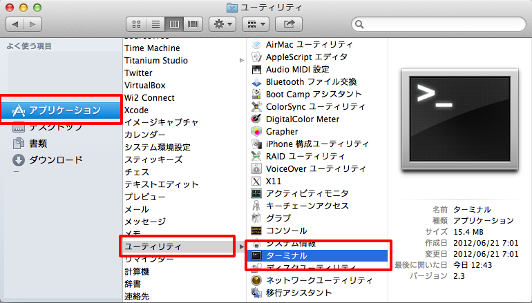
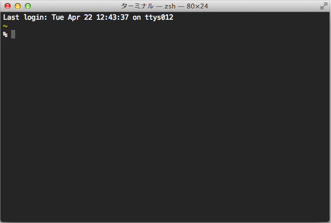
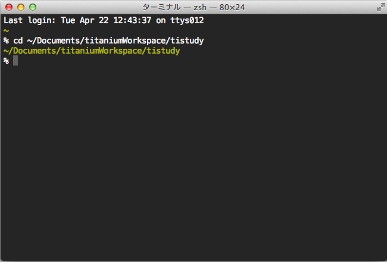
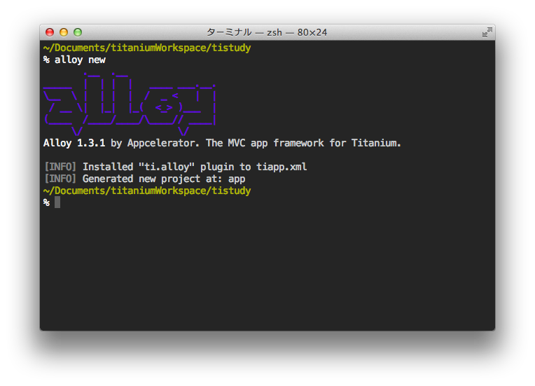

# はじめてのAlloy

## はじめに

先程も触れましたが、Titanium Classic環境での開発知識だけでは残念ながらすぐにAlloyを使いこなせるわけではないため、簡単な画面遷移のサンプルアプリケーションの開発について取り上げながらAlloyの構造について学びことをメインに解説をしていきます。

## Alloyを利用するための手順

これまで作ってきたプロジェクトをベースにAlloyを利用できるようにします。

新規にAlloyベースのアプリケーションを作成する場合には、Titanium Studioで該当するテンプレートを
選択すればOKですが調べる限り、既存のTitanium Classic環境のプロジェクトをAlloy利用できるようにするためには、ターミナルでの作業が必要になるようなので、以下に手順を示します。

現在作ってるプロジェクトが「書類」フォルダ配下にtitaniumWorkspaceというディレクトリがあり、その下に
tistudyというプロジェクトを作成してる前提での説明になりますので、適宜ご自身の環境で読み替えてください。

### ターミナルを起動する

Macのアプリケーションフォルダ → ユーティリティ → ターミナル と選択します



### 現在作成中のフォルダに移動する

ターミナルが起動すると以下の様な画面が表示されます。



画面上に、以下のコマンドを入力します。（参考までにcdというコマンドの意味はは、**c**hange **d**irectory の略で、cdの後に移動したいディレクトリ名を入力することでそのディレクトリ（フォルダ）に移動できます。

```sh
cd Documents/titaniumWorkspace/tistudy
```

コマンド入力完了すると以下のようになります。



該当のディレクトリまで移動できたら

```sh
alloy new
```

というコマンドを入力します。

コマンド入力すると以下のような内容が表示されます。



```sh
       .__  .__                
_____  |  | |  |   ____ ___.__.
\__  \ |  | |  |  /  _ <   |  |
 / __ \|  |_|  |_(  <_> )___  |
(____  /____/____/\____// ____|
     \/                 \/
Alloy 1.3.1 by Appcelerator. The MVC app framework for Titanium.

[INFO] Installed "ti.alloy" plugin to tiapp.xml
[INFO] Generated new project at: app
```

最後の **Generated new project at: app** が表示されていればOKです


Alloyが利用できるようになったかと思いますが、念のためこの段階でbuildしてみます

```sh
ti build --platform ios
```

<p><span itemscope itemtype="http://schema.org/Photograph"></span></p>


Alloy導入後のプロジェクトのディレクトリ構造としては、Resources以外に、app というディレクトリが自動的に生成されるのでひとまずその点だけは念頭に置いておいたほうが良いかと思います。

```sh
├── LICENSE
├── README
├── Resources
│   ├── alloy
│   ├── app.js
│   └── iphone
├── app
│   ├── README
│   ├── alloy.js
│   ├── assets
│   ├── config.json
│   ├── controllers
│   ├── models
│   ├── styles
│   └── views
├── build
│   ├── alloy
│   ├── iphone
│   └── map
├── plugins
│   └── ti.alloy
└── tiapp.xml
```


## 画面遷移系のサンプルアプリ

Alloyが利用できる環境が整ったので、簡単な画面遷移のサンプルアプリケーションを例にAlloyの構造の説明をしていきます。


### 作成するファイル＆それぞれの対応関係

まず、現在作成中のプロジェクトのappディレクトリのcontrollers、styles、viewsにそれぞれ以下のようにファイルを作成します

- controllers
    - index.js
    - newWindow.js
- styles
    - index.tss
    - newWindow.tss
- views
    - index.xml
    - newWindow.xml

起動時の画面＆画面遷移後の画面イメージと、それぞれ対応するファイル群の対応関係を絵にしてみました

<p><span itemscope itemtype="http://schema.org/Photograph"></span></p>


<p><span itemscope itemtype="http://schema.org/Photograph"></span></p>


### キモとなるコードの解説

上記の対応関係の紫色の枠＆線でつなげてる部分が画面遷移する上でキモとなる処理になるかと思います。

具体的には

- 画面遷移先の処理と対応関係にある呼び出し先のコントローラーを 起動時に実行されるindex.coffeeに記述する
    - Alloy.createController('xx')としてる所。xxの方は処理を渡すコントローラーの名前の拡張子を取った名前（今回だとnewWindow）を指定する
    - 処理を渡した後に呼びだすメソッド名を記述する
- 呼び出される側のコントローラーのファイルの newWindow.coffee   
    - 処理を渡した後に呼びだされるメソッドを実装する。
    - 遷移後のWindowは、Window#newWindow.container という形でマークアップしており、id名であるnewWindowを指定してopen()にてWindowを開く

という感じです。

### 実際のコード

#### 起動時の画面

index.coffee

```coffee
$.mainWindow.open()

$.label.addEventListener 'click', (e) ->
  newWindow = Alloy.createController('newWindow')
  return newWindow.move()
```

index.jade

```Jade
Alloy
  Window#mainWindow.container
    Label#label Hello, World!!!!!!!
```

index.tss

```css
".container": {
	backgroundColor:"#fff"
},
"#label": {
	width: Ti.UI.SIZE,
	height: 40,
	color: "#000",
  top:50,
  left:10

} 
```

#### 遷移後の画面

newWindow.coffee

```coffee
exports.move = () ->
  alert "Moved!"
  return $.newWindow.open()

```

newWindow.jade

```Jade
Alloy
  Window#newWindow.container
    Label#label This is a new Window
```

newWindow.tss

```css
".container":{
    backgroundColor:"#fff"
}

"#label": {
	width: Ti.UI.SIZE,
	color: "#222",
  top:"50%"
} 
```
