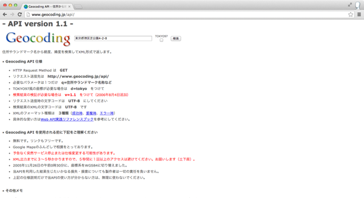

## 参考情報

### 緯度経度と単位について

- 緯度（latitude）は赤道を０度として北：＋（プラス）南：ー（マイナス）の数字で表現
- 経度（longitude）はグリニッジ天文台跡を南北へ通る子午線を０度として東：＋（プラス）
西：ー（マイナス）の数字で表現


緯度経度を10進法で示すDegree単位で東京駅周辺の丸の内のビルは+35.679113、+139.763137 という形式で表現されます。

※60進で表現する度分秒（DMS）というのもあるそうですがインターネット上ではDegree単位が利用されることが多いそうです


### 測地系について

同じ場所でも利用する測地系（datum）によって緯度経度の値が変わる。日本で気にする必要があるのは以下２つ

- 日本測地系
- 世界測地系

日本では2002年4月1日まで日本測地系が使われてきた経緯があり、サービスによってはまだ日本測地系を利用しているものもあるそうで、日本測地系に基づいた緯度経度と世界測地系のそれとでは、約400mのズレが生じるそうです

### 住所から緯度経度を調べる方法

住所から緯度経度を調べることが出来るWebサービスはいくつかあるようですが、個人的には[Geocoding API](http://www.geocoding.jp/api/)を良く利用してるので東京タワーの住所（東京都港区芝公園4-2-8)を例にして説明します

まずはサイトにアクセスして、検索ボックス欄に住所を入力して、検索ボタンをクリックします



検索完了すると、以下の様なXML形式の情報が画面に表示されるかと思います


```xml
<result>
  <version>1.1</version>
  <address>東京都港区芝公園4-2-8</address>
  <coordinate>
    <lat>35.658704</lat>
	<lng>139.745408</lng>
	<lat_dms>35,39,31.334</lat_dms>
	<lng_dms>139,44,43.469</lng_dms>
  </coordinate>
  <url>
http://www.geocoding.jp/?q=%E6%9D%B1%E4%BA%AC%E9%83%BD%E6%B8%AF%E5%8C%BA%E8%8A%9D%E5%85%AC%E5%9C%924-2-8
  </url>
  <needs_to_verify>no</needs_to_verify>
  <google_maps>東京都港区芝公園４丁目２−８</google_maps>
</result>
```

緯度の情報は、latというタグで囲まれてる値になります。この場合だと35.658704です
経度の情報は、lngというタグで囲まれてる値になります。この場合だと139.745408です


#### 東京タワー

- 住所：東京都港区芝公園4-2-8
- 緯度：35.658704
- 経度：139.745408

#### 都庁前

- 住所：東京都新宿区西新宿2-8-1
- 緯度：35.689185
- 経度：139.691648


### スマートフォンの位置情報取得方法について

たいていのスマートフォンではGPS機能を利用できるかと思いますが、位置についての正確さ、バッテリの消費量、位置情報を取得する時に必要な時間といった部分については、トレードオフの関係が成り立っています。

そのため、精度を要求する場合には、それに伴って計測にかかる時間が長く、バッテリ消費量が大きくなってしまいます


iPhoneの場合にはプログラムから測位方式指定不可ですが、Androidの場合にはプログラムから測位方式指定可能です

