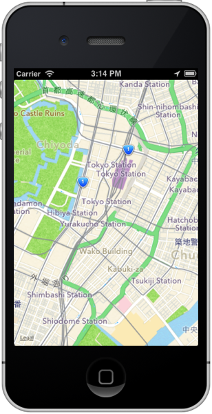
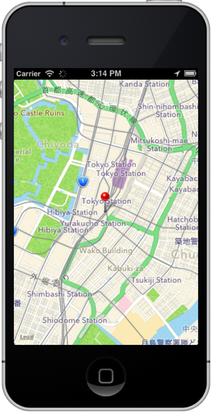
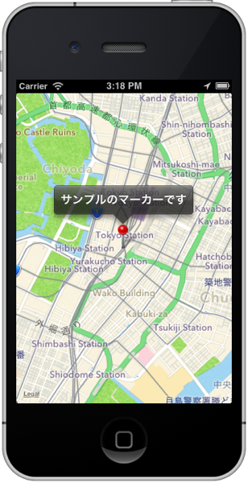

## 地図情報を活用したサンプルアプリ開発

この章では地図情報を活用したアプリケーションの開発方法について説明していきます。まず最初に地図情報を表示する部分について説明した後に、地図上にマーカーを表示する方法について説明します。

### 地図情報のみを表示する

まず最初にこのような表示が出来るアプリケーションを開発します



1. プロジェクト作成時に自動的に生成された **app.jsの中身のソースコードを全て削除**します。
2. その後に以下を記述します

```javascript
var mapWindow,mapView;

mapWindow = Titanium.UI.createWindow({
  title:'位置情報処理',
  backgroundColor:'#fff'
});
mapView = Titanium.Map.createView({
  mapType: Titanium.Map.STANDARD_TYPE,	// (1)
  region: {								// (2)
    latitude:35.676564,
    longitude:139.765076,		
    latitudeDelta:0.025,
    longitudeDelta:0.025
  },
  animate:true,
  regionFit:true,
  userLocation:true,
  top:0,
  left:0,
  width:Ti.UI.FULL,
  height:Ti.UI.FULL
});
mapWindow.add(mapView);
mapWindow.open();
```

1. 表示する地図の形式を設定します。なおサンプルで設定してる **Titanium.Map.STANDARD_TYPE** 以外に衛星画像を表示する、**Titanium.Map.SATELLITE_TYPE**　と標準地図と衛星地図の両方を表示する **Titanium.Map.HYBRID_TYPE** が設定できます
2. どの地域を地図上で表示するかを決定するのがregionプロパティになります。具体的には緯度を意味する**latitude**と、経度を意味する**longitude** と縮尺に関する情報の**latitudeDelta** と **longitudeDelta** を設定します

latitudeDelta,longitudeDeltaそれぞれについて補足をすると以下のようになります

- latitudeDelta: 現在の縮尺で画面の上端の緯度と下端の緯度の差になります
- longitudeDelta:現在の縮尺で画面の左端の緯度と右端の緯度の差になります

### 地図上にマーカーを表示する

先ほど作ったサンプルアプリでは単に地図を表示するだけのものなので、今度は任意の箇所にマーカーを表示する機能を実装します。

マーカー表示状態ではこのような画面になります



マーカーをクリックした時の画面はこのようになります



```javascript
var mapWindow,mapView,marker;

mapWindow = Titanium.UI.createWindow({
  title:'位置情報処理',
  backgroundColor:'#fff'
});
mapView = Titanium.Map.createView({
  mapType: Titanium.Map.STANDARD_TYPE,
  region: {
    latitude:35.676564,
    longitude:139.765076,
    latitudeDelta:0.025,
    longitudeDelta:0.025
  },
  animate:true,
  regionFit:true,
  userLocation:true,
  top:0,
  left:0,
  width:Ti.UI.FULL,
  height:Ti.UI.FULL
});
// 先ほど作ったアプリに以下を追記します
marker = Titanium.Map.createAnnotation({
  latitude:35.676564,// (1)
  longitude:139.765076, //(2)
  title: "サンプルのマーカーです",		// (3)
  animate: false, //(4)
  leftButton: "", //(5)
  rightButton:"" //(6)
});
mapView.addAnnotation(marker);
// ↑ここまでが追記箇所

mapWindow.add(mapView);
mapWindow.open();
```
1. マーカーを表示したい箇所の緯度情報を設定します
2. マーカーを表示したい箇所の経度情報を設定します
3. マーカーをクリックした時に表示する文字を設定します
4. マーカーを画面表示する時に、画面上部からアニメーションするかどうか設定できます。アニメーション表示したい場合にはtrueにします
5. マーカーをタッチ時のポップアップの左側に独自のアイコン画像を設定することが出来ます。今回のサンプルでは画像無しに設定してます
6. マーカーをタッチ時のポップアップの右側に独自のアイコン画像を設定することが出来ます。今回のサンプルでは画像無しに設定してます

