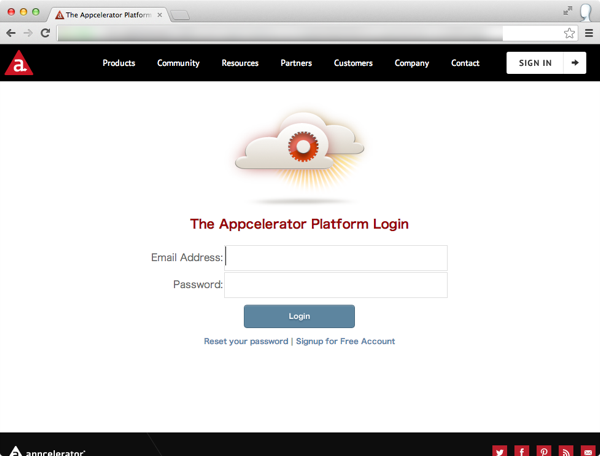
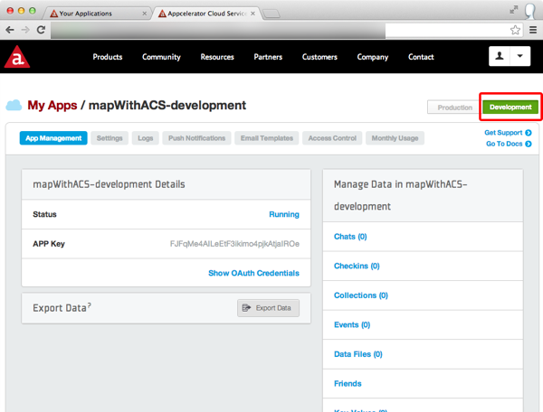
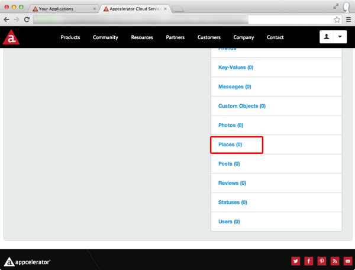
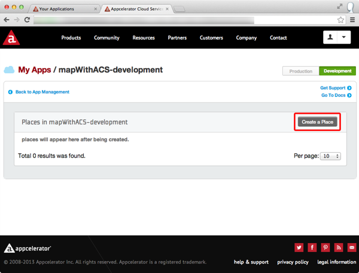
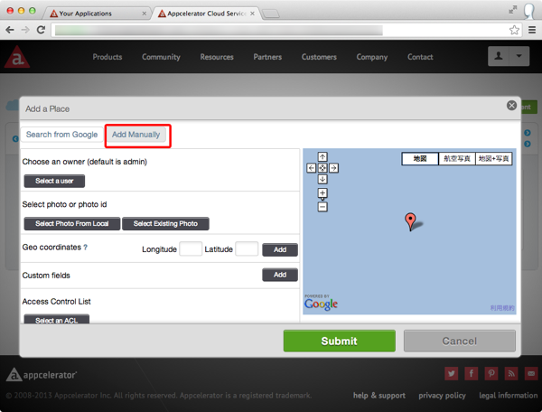

# ACSとの連携

先ほどACSを利用する手順を解説しましたので実際にACSにデータを登録した上でその情報を取得して地図上に表示するアプリケーションを開発します。

## 今回のサンプルアプリで利用するデータについて

東京タワーと都庁前の2つのサンプルデータを以下に記載しましたのでこちらを利用することにします。

- 東京タワー
    - 住所：東京都港区芝公園4-2-8
    - 緯度：35.658704
    - 経度：139.745408
- 都庁前
    - 住所：東京都新宿区西新宿2-8-1
    - 緯度：35.689185
    - 経度：139.691648

なお、住所から緯度と経度の情報を調べる方法を参考資料にまとめていますので、今後独自にデータを登録したい場合には、参考資料の情報を参考にご自身で緯度経度を調べた上で登録してみて下さい。

## ACSの管理画面からデータ登録する

ACSの管理画面にアクセスして上記データを登録するため、Webブラウザを起動してACSの管理画面の以下URLにアクセスします。

[http://my.appcelerator.com/apps](http://my.appcelerator.com/apps)

以下のログイン画面が表示されるので、Titanium Studioを利用する際に利用してるログインIDとパスワードを入力します。



Titanium Mobileで開発してるアプリケーション名の一覧が表示されるので今回作ってるProjectの **mapWithACS** を探して、クリックします。


再度ログインを促されるのでログインIDとパスワードを入力します。


以下のようにアプリケーションの管理画面が表示されます。



アプリケーションの管理画面では

- テスト環境用のデータ:
- 本番環境用のデータ:

の２つを管理することが出来ます。

Development ボタンをクリックすることでテスト環境用の設定に切り替わり、Productionボタンをクリックすることで本番環境用の設定に切り替わります。

AppStoreに公開することがないなら、Developmentボタンをクリックしてテスト環境を利用することをオススメします。今回もDevelopment ボタンをクリックしてテスト環境にデータ登録します。

なお、Developmentボタンをクリックすると、Developmentボタンは白文字で緑色が下地になるのでその状態になってることを確認した上で、Places右側に並んでるメニューから **Places** をクリックします。



Placesの管理画面が表示されたら、**Create a place** をクリックします。



クリック後、以下のような画面が表示されます。



データ登録方法は、Googleローカルの情報を検索するやり方もありますが、位置情報によってはうまく見つからないこともあるので、マニュアル登録をする方法について説明します。Add Manuallyボタンをクリックすると、データ登録画面が表示されます。


赤く囲った所は入力必須になってます。東京タワーの情報を例に順番に説明します。

- Enter your business name: 場所の名前を入力するので、**東京タワー**と入力します
- Address:ここに住所を入力するため**港区芝公園4-2-8**と入力します
- City: **東京都**と入力します

また、赤枠以外の所は任意ですが、緯度経度が入力されていないと、Titanium Mobileで開発するアプリから検索できなくなるため、以下のように入力します

- latitude：**35.658704**
- longitude：**139.745408**

入力が完了したら、Submitボタンをクリックしてデータ登録は完成です。

この要領で、残りのデータも登録します。

## ACSに登録したデータを検索して地図上にマーカーを表示する

ACSにデータを登録する手順を解説しましたが、そのデータを検索して地図上にマーカーを表示する昨日を実装します。

ACS上のデータを検索する処理としては

1. ACSを活用するモジュールを読み込む
2. 1.で読み込んだモジュールの機能を活用してデータを検索する処理

に大別できます。

Titanium Mobileの標準のAPIで提供される以上のことを実現するために、開発元だけではなくサードパーティーの会社や、個人の開発者などが、ObjectiveC（Android向けの場合にはJava）で書かれたプログラムを読み込むことが出来ます。

このプログラムのことをネイティブモジュールと呼びます（ネット上では単にモジュールという言い方をしてるケースもあります）

ACSと連携するアプリケーションを作る場合には、Titanium Mobileの開発元のAppceleratorが提供してるモジュールを利用します

### モジュール読み込み方法

モジュールを読み込む場合には

```javascript
var module = require('モジュール名');
```
のように記述します。

Titanium Mobileの開発元のAppceleratorが提供するACS連携モジュールの場合には

```javascript
var cloud = require('ti.cloud');
```
のように記述します。


### ACSからデータを検索してその結果を地図上に表示する

先ほど作ったアプリではあらかじめ設定したデータを元にして、任意の場所にマーカーを表示する機能を実装しましたので、それを改造して、ACSからデータを検索してその結果を地図上に表示するアプリケーションを作ります

```javascript
var mapWindow,mapView,marker;

mapWindow = Titanium.UI.createWindow({
  title:'位置情報処理',
  backgroundColor:'#fff'
});
mapView = Titanium.Map.createView({
  mapType: Titanium.Map.STANDARD_TYPE,
  region: {
    latitude:35.676564,
    longitude:139.765076,
    latitudeDelta:0.025,
    longitudeDelta:0.025
  },
  animate:true,
  regionFit:true,
  userLocation:true,
  top:0,
  left:0,
  width:Ti.UI.FULL,
  height:Ti.UI.FULL
});

var cloud = require("ti.cloud"); // (1)
cloud.Places.query({             // (2)
  page:1,                        // (3)
  per_page:20
},function(e){                   // (4)
  var data, i, place, result,marker;
  if(e.success){
    i = 0;
    while(i < e.places.length){  // (5)
      place =  e.places[i];
      marker = Titanium.Map.createAnnotation({
        latitude: place.latitude,
        longitude: place.longitude,
        title: place.name,
        animate: false,
        leftButton: "",
        rightButton:""
      });
      mapView.addAnnotation(marker);
      i++;                       // (6)
    }

  } else {
    Ti.API.info("Error:\n" + ((e.error && e.message) || JSON.stringify(e)));
  }
});

mapWindow.add(mapView);
mapWindow.open();
```

### ソースコード解説

1. ACSを活用するために、モジュールを読み込みます。読み込んだ値を変数cloudに格納しており、これ以降cloud.xxx.xxx()という形でACS上にあるデータを検索したり、登録することが可能になります
2. ACSに登録した時に **places** の項目の情報を検索する時には、Places.query()というメソッドを呼び出すことで実現できます。
3. ACSのデータを検索するときに、Places.query()メソッドにオプションとなる値を設定することで細かい条件検索ができます。今回は件数が少ないですが例えば登録データが1000件あるような場合、per_pageの値を設定することで1検索あたりのデータ数を設定することができます。（今回のように20と指定すると1回あたり20件までしか取得できません）またページと言う概念があるため、最初に20件取得したあと21件目のデータを取得したい場合には、pageという項目に適切な値を設定することで次のデータを取得できます
4. Places.query()メソッドで検索された結果は、コールバック関数に値が引き渡されます。ここの変数eの値を参照することで、検索の成功・失敗や実際のデータが参照できます
5. Places.query()メソッドで検索された結果を順番に得るために、配列のe.placesの長さ分ループ処理をします
6. ループのカウンターとして利用してる変数iの値に1つ増加させます


