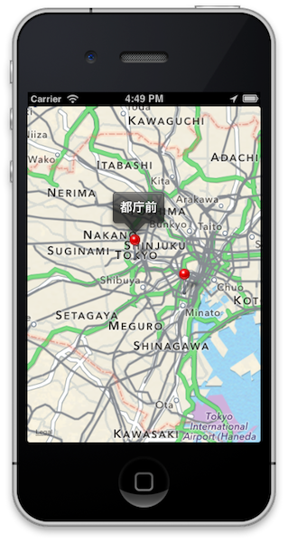

## 今回のワークショップのためのプロジェクトを設定する

TitaniumStudioを起動した後、File→New→Titanium Mobile Projectと進みます

Project Template画面が標示されたら、Default Projectを選択します

プロジェクト設定画面が表示されますので今回は以下入力してプロジェクトの設定を行います

- Project name: **mapWithACS**
- App Id: **com.streetacademy.mapWithACS**

しばらくして設定が完了すると、以下のような画面が表示されればOKです

## 今回作るアプリケーションのイメージ

今回は以下のように地図上の任意の箇所にマーカーが表示されており、マーカーをクリックするとその場所の名称が表示されるアプリケーションを作ります

