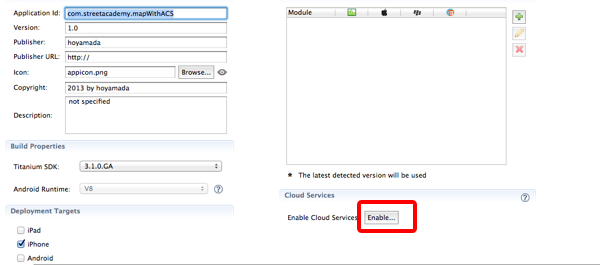
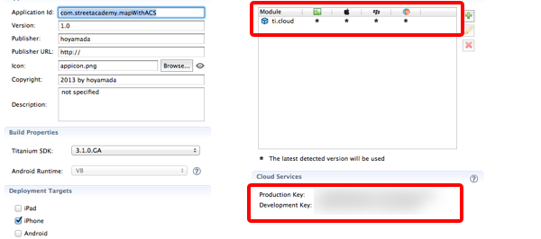

# ACSの解説

## はじめに

先ほど作ったアプリケーションでは、緯度、経度の情報を予め設定したものを画面に表示する機能を実装しましたがこれだとあまり実用的なアプリケーションとはいえないため、サーバー上に配置した緯度、経度の情報を読み込んだ上で地図上に表示するアプリケーションに仕上げていきます。

サーバーサイドのアプリケーションをゼロベースで開発するとなると敷居が高くなってしまうため、Titanium Mobileの開発元のAppceleratorが提供してるACSという便利なサービスを活用していきます。

## ACSとは？

スマートフォン向けのアプリケーションを開発する場合にサーバーサイドのアプリケーションが必要になってきますが、その際に必要となりそうな機能というのは

- ユーザ登録・管理機能・FacebookやTwitter等のソーシャルアカウント連携
- データ共有
- 写真データのアップロード機能
- スマートフォンへのプッシュ通知機能

という形に集約されるケースが多くなるかと思います。

こういう機能を手軽に利用できるようサービスの概念を **MBaaS** （Mobile Backend as a Serviceの略でエムバースという読み方をします）というのものがあります。

Titanium Mobileの開発元のAppceleratorでは MBaaS の１つとしてACSというものを提供してます。

ACSを使うことで、サーバーサイドのアプリケーションを作りこむことなく手軽に位置情報の管理をすることが出来るようになります

## ACSの利用方法について

ACSと連携したアプリケーションを開発する場合に、アプリケーションに関する情報を管理してるtiapp.xmlの修正をする必要があります。

具体的には以下2つの作業が必要になります

1. デフォルトでは無効になってるCloud Servicesを有効にする
2. ti.cloudというモジュールを利用できるようにする

※ 1.のCloud Servicesを有効にすることで、自動的にti.cloudというモジュールを利用できるようになるはずです。

### ACS利用の流れ

Titanium StudioのApp Explorer 上で、tiapp.xmlをダブルクリックして、tiapp.xmlを開きます

以下のような画面が標示されるかと思います。

インターネット接続ができる状態であることを念のため確認した上で、Enable　Cloud Servicesの項目のEnableボタンをクリックします

しばらくすると、Enableボタンの表示が切り替わり以下のようにProduction Keyとdevelopment Keyの２つが表示されればOKです

