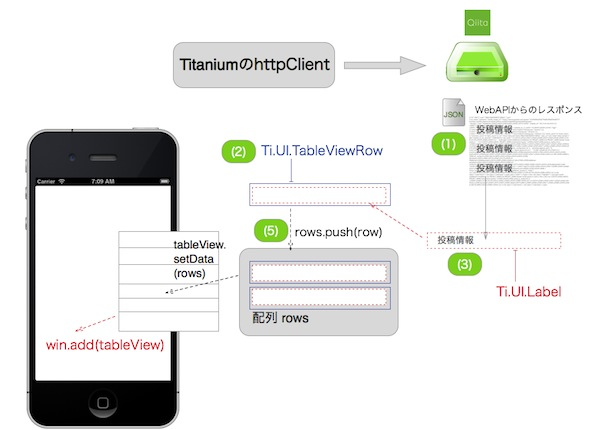
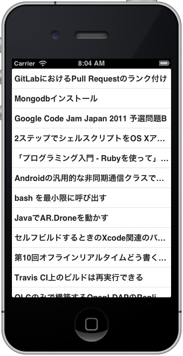
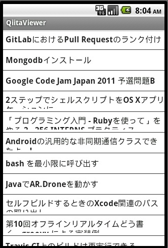
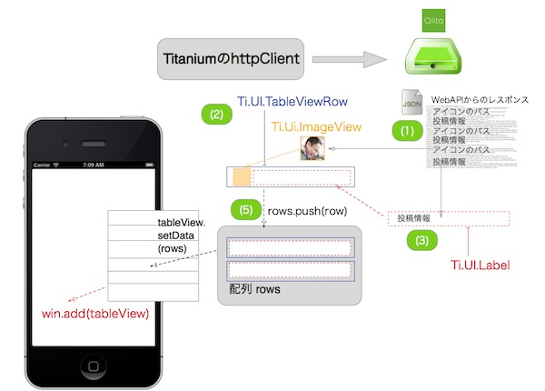
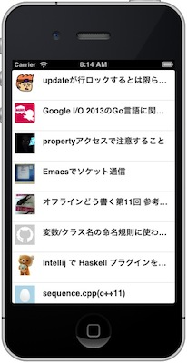
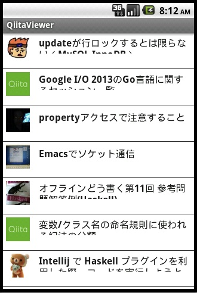

## 取得したQiitaの投稿情報をTableViewを使って画面表示する

httpCLientを活用してQiitaの投稿情報を取得する処理まで実装できたので、今度は取得した情報をTableViewの機能と連携させて画面に表示する方法について解説します。

## 取得した投稿情報のタイトルだけ表示する

Qiitaの開発者向けのAPIを通じて投稿情報を取得した結果をTableViewを活用して表示する方法について解説します。

図にすると以下の様な処理になります。



以下のソースコードをサンプルに順次解説していきます。

```javascript
var xhr,qiitaURL,method,mainTable,win;
mainTable = Ti.UI.createTableView({
  width: 320,
  height:480,
  backgroundColor:"#fff",
  left: 0,
  top: 0
});
win = Ti.UI.createWindow({
  title:'QiitaViewer'
});

qiitaURL = "https://qiita.com/api/v1/items";
method = "GET";
xhr = Ti.Network.createHTTPClient();
xhr.open(method,qiitaURL);
xhr.onload = function(){
  var body,i ,len ,row ,rows,textLabel;
  if (this.status === 200) {
    body = JSON.parse(this.responseText);
    rows = [];
    for (i = 0, len = body.length; i < len; i++) { // (1)
      Ti.API.info(body[i].title);
      row = Ti.UI.createTableViewRow({	// (2)
        width: 'auto',
        height:40,
        borderWidth: 0,
		className:'entry',
        color:"#222"
      });
      textLabel = Ti.UI.createLabel({	// (3)
        width:'auto',
        height:30,
        top:5,
        left:5,
        color:'#222',
        font:{
          fontSize:16,
          fontWeight:'bold'
        },
        text:body[i].title
      });
      row.add(textLabel);		// (4)
      rows.push(row);			// (5)
    }
    mainTable.setData(rows);    // (6)
    win.add(mainTable);
    win.open();

  } else {
    Ti.API.info("error:status code is " + this.status);
  }
};
xhr.onerror = function(e) {
  var error;
  error = JSON.parse(this.responseText);
  Ti.API.info(error.error);
};

xhr.send();
```

### ソースコード解説

1. body.lengthの値を確認することでWebAPIから取得した投稿件数が確認できるので、その件数分ループして、投稿情報を１つづつ取り出していきます
2. 投稿情報の要素を格納するためにTableViewRowを生成します
3. 投稿情報のタイトル部分を格納するためにLabelを生成します
4. 上記で生成したLabelをTableViewRowに配置します
5. TableViewRowを配列rowsに挿入します
6. WebAPIから取得した投稿件数分のTableViewRowが配列rowsに格納されているので、その情報をTableViewに表示するために、setDataメソッドを使います

上記をbuildして、iPhone、AndroidのEmulatorで表示した場合以下の様になります

<!-- #### iPhone起動時の画面キャプチャ -->



<!-- #### Android起動時の画面キャプチャ -->

<!--  -->


## 取得した投稿情報のタイトルとアイコン画像を表示する

先程は、タイトルのみ表示する方法について解説しましたが、タイトルだけではなく投稿したユーザのアイコンをTableViewを活用して表示する方法について解説します

図にすると以下の様な処理になります。



TableViewを使って投稿情報のタイトルと投稿したユーザのアイコンを表示するソースコード全体は以下になります

```javascript
var xhr,qiitaURL,method,mainTable,win;
mainTable = Ti.UI.createTableView({
  width: 320,
  height:480,
  backgroundColor:"#fff",
  left: 0,
  top: 0
});
win = Ti.UI.createWindow({
  title:'QiitaViewer'
});

qiitaURL = "https://qiita.com/api/v1/items";
method = "GET";
xhr = Ti.Network.createHTTPClient();
xhr.open(method,qiitaURL);
xhr.onload = function(){
  var body,i ,len ,row ,rows,textLabel,iconImage,imagePath;
  if (this.status === 200) {
    body = JSON.parse(this.responseText);
    rows = [];
    for (i = 0, len = body.length; i < len; i++) {
      row = Ti.UI.createTableViewRow({
        width: 'auto',
        height:60,
        borderWidth: 0,
		className:'entry',
        color:"#222"
      });
      textLabel = Ti.UI.createLabel({
        width:250,
        height:30,
        top:5,
        left:60,
        color:'#222',
        font:{
          fontSize:16,
          fontWeight:'bold'
        },
        text:body[i].title
      });
      imagePath = body[i].user.profile_image_url;
      iconImage = Ti.UI.createImageView({
        width:40,
        height:40,
        top:5,
        left:5,
        defaultImage:"logo.png",
        image: imagePath
      });

      row.add(textLabel);
      row.add(iconImage);
      rows.push(row);
    }
    mainTable.setData(rows);
    win.add(mainTable);
    win.open();

  } else {
    Ti.API.info("error:status code is " + this.status);
  }
};
xhr.onerror = function(e) {
  var error;
  error = JSON.parse(this.responseText);
  Ti.API.info(error.error);
};
xhr.timeout = 5000;
xhr.send();
```

上記ソースコードをbuildして、iPhone、AndroidのEmulatorで表示した場合以下の様になります

<!-- #### iPhone起動時の画面キャプチャ -->



<!-- #### Android起動時の画面キャプチャ -->

<!--  -->


### WebAPI経由で画像を表示する際に意識しておくべきポイント

今回のようなWebAPIを通じて画像を取得して表示するような場合、ネットワークの回線状況によってはすぐに表示されるとは限らず、利用するユーザさんにとって使い勝手が悪い印象をあたえる可能性があります。

ImageViewにはdefaultImageというプロパティがあります。

```javascript
// 一部抜粋
imagePath = body[i].user.profile_image_url;
iconImage = Ti.UI.createImageView({
  width:40,
  height:40,
  top:5,
  left:5,
  defaultImage:"logo.png", // Resources/logo.pngを準備してある前提です
  image: imagePath
});
row.add(iconImage);
```

上記のようにここにあらかじめローカルに準備しておいた画像パスを設定することで

1. 最初にローカルの画像が表示
2. 画像のダウンロード完了時に、ローカルの画像とリモートから取得した画像が入れ替わる

という処理が自動的にされるのでこれを適切に設定することをお勧めします。
