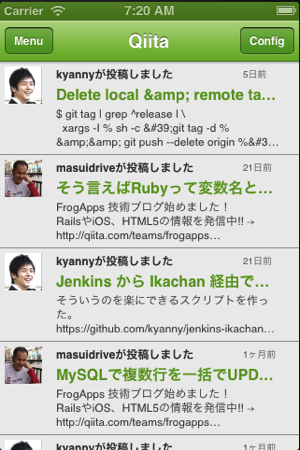
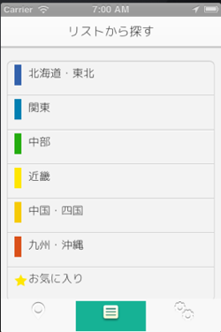

## TableViewの使い方について学ぶ
ニュースリーダー系のアプリケーションに採用されているユーザインタフェースとして垂直方向にスクロールしながら情報を表示する以下の様なアプリケーションがあるかと思います。

<table>
<th>TiQiitaの画面キャプチャ</th>
<th>CraftBeerFanの画面キャプチャ</th>
<tr>
<td>

</td>
<td>

</td>
</tr>

</table>

上記のようなユーザインタフェースをもったアプリケーションを開発する際に必要となるTableViewの使い方について説明します
