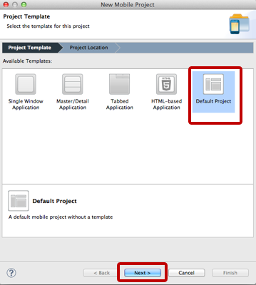

## プロジェクト設定

TitaniumStudioを起動した後、File→New→Titanium Mobile Projectと進みます

Project Template画面が標示されたら、Default Projectを選択します

プロジェクト設定画面が表示されますので今回は以下入力してプロジェクトの設定を行います

- Project name: **tableView**
- App Id: **com.streetacademy.tableView**

しばらくすると設定が完了します
