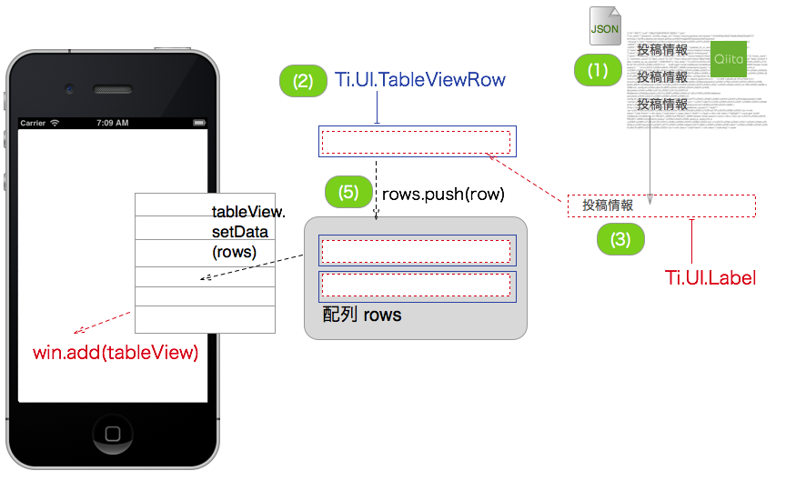

## サンプルデータを表示させる

Titanium Mobileの標準APIであるhttpCLientを通じてQiitaの投稿情報を取得した後に、TableViewを使って画面に表示する機能を最初から作るとなると、理解が進まない可能性があるかと思います。

そこで、まずはあらかじめ準備してあるサンプルデータでのTableViewの使い方について説明します

これから実装する処理イメージとしては以下のようになります



サンプルデータは以下に準備してあるので、Webブラウザでダウンロードして、必ず現在開発中のTitanium MobileのプロジェクトのResourcesフォルダ直下に保存してください

[https://raw.github.com/h5y1m141/20130817-tistudy/master/sample.json](https://raw.github.com/h5y1m141/20130817-tistudy/master/sample.json)

保存が完了したら、以下要領で作業をします

1. 先ほどの **app.jsの中身のソースコードを全て削除**します。
2. その後に以下を記述します

```javascript
var sample, file, body, mainTable, win, i ,len ,row ,rows,textLabel;
// ダウンロードしたJSONファイルを読み込む処理
sample = Ti.Filesystem.getFile(Ti.Filesystem.resourcesDirectory, "sample.json");
file = sample.read().toString();
body = JSON.parse(file);

mainTable = Ti.UI.createTableView({
  width: 320,
  height:480,
  backgroundColor:"#fff",
  left: 0,
  top: 0
});
win = Ti.UI.createWindow({
  title:'QiitaViewer'
});
rows = []
for (i = 0, len = body.length; i < len; i++) { // (1)
  row = Ti.UI.createTableViewRow({	// (2)
    width: 'auto',
    height:40,
    borderWidth: 0,
	className:'entry',
    color:"#222"
  });
  textLabel = Ti.UI.createLabel({	// (3)
    width:'auto',
    height:30,
    top:5,
    left:5,
    color:'#222',
    font:{
      fontSize:16,
      fontWeight:'bold'
    },
    text:body[i].title
  });
  row.add(textLabel);		// (4)
  rows.push(row);			// (5)
}
mainTable.setData(rows);    // (6)
win.add(mainTable);
win.open();
```
### 上記ソースコード解説

1. body.lengthの値を確認することで投稿件数が確認できるので、その件数分ループして、投稿情報を１つづつ取り出していきます
2. 投稿情報の要素を格納するためにTableViewRowを生成します
3. 投稿情報のタイトル部分を格納するためにLabelを生成します
4. 上記で生成したLabelをTableViewRowに配置します
5. TableViewRowを配列rowsに挿入します
6. 投稿件数分のTableViewRowが配列rowsに格納されているので、その情報をTableViewに表示するために、setDataメソッドを使います

