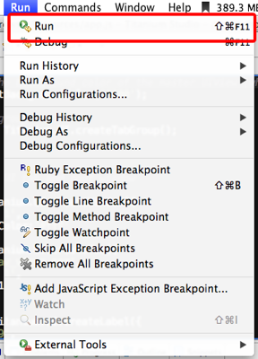
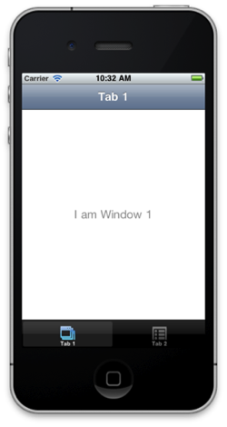

## プロジェクト設定

TitaniumStudioを起動した後、File→New→Titanium Mobile Projectと進みます

Project Template画面が標示されたら、Default Projectを選択します

プロジェクト設定画面が表示されますので今回は以下入力してプロジェクトの設定を行います

- Project name: **webbrowse**
- App Id: **com.streetacademy.webbrowse**

今回はローカルでの作業のため App Idを仮にこのようにしましたがAppStoreで配布する場合、他のアプリケーションと重複することは出来ません。

しばらくして設定が完了すると、以下のような画面が表示されればOKです

プロジェクト設定が完了するといくつかのフォルダ＆ファイルが自動生成されます

この段階でiPhoneアプリケーションをbuildして動作確認してみましょう。

Titanium Studioで、Run → Runと進みます。

しばらくすると以下のようにiPhone Simulatorが立ち上がることを確認します。

