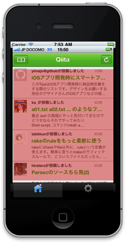
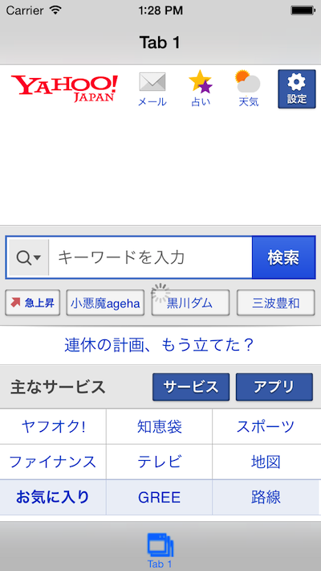
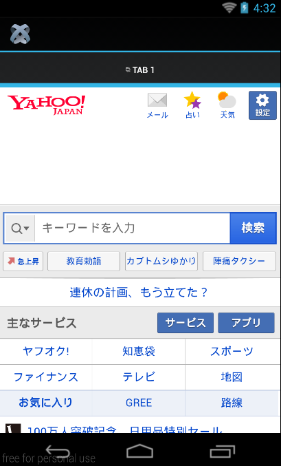
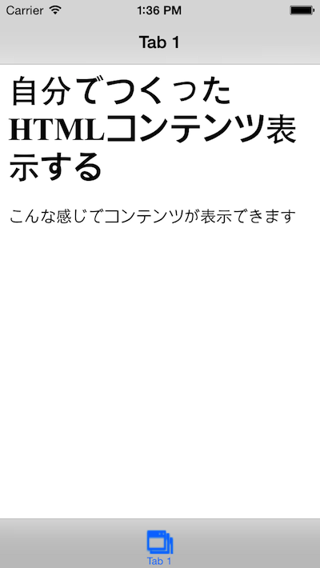
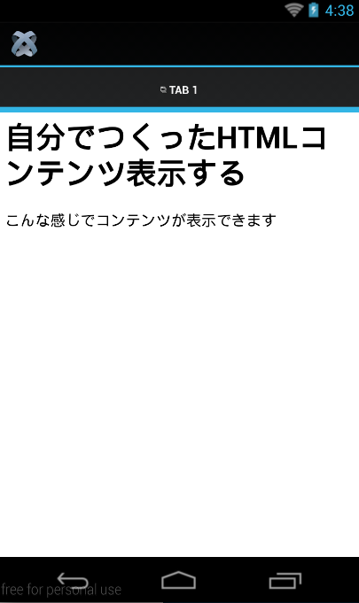
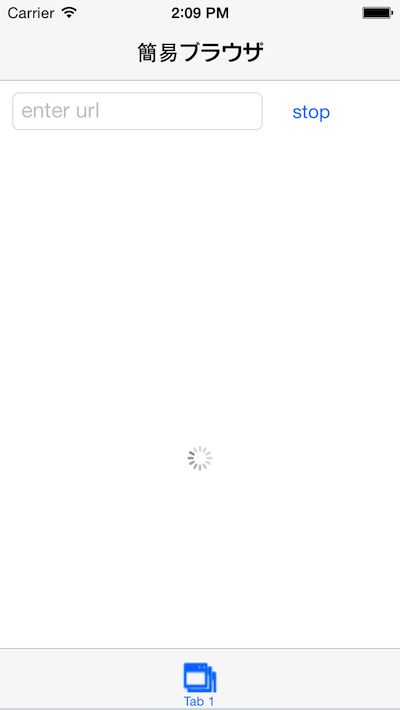
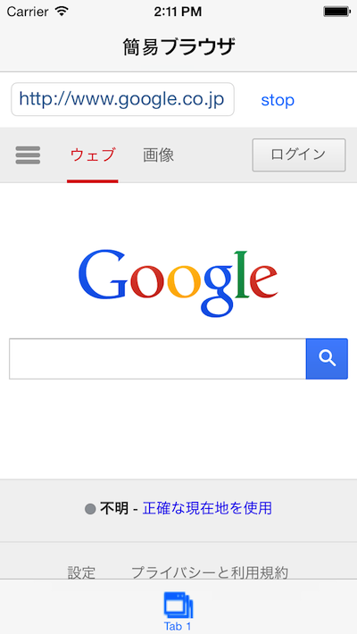
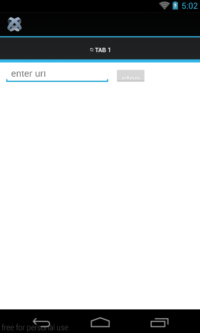
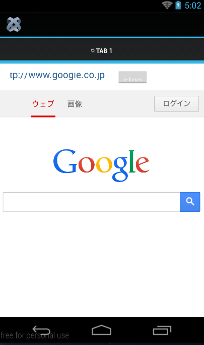

# WebViewを活用した簡易Webブラウザ開発

## WebViewとは？
WebKitブラウザ機能とほぼ同等の機能を持った部品です。

HTML5/CSS3ベースのHTMLコンテンツをほぼそのまま動作させることが可能で、指定したURLのHTMLコンテンツ表示やあらかじめ自分が作成したHTMLコンテンツの表示などを行うことができます

※WebKitとは：
WebブラウザのSafariにも標準搭載されるオープンソースソフトウェアでHTML、CSS、JavaScript等を解釈して画面描画を担当してます。



なお、WebViewの良い点としては、HTMLコンテンツが表示できるのでCSSと組み合わせることで細かいレイアウトを実現できる所があります。

しかしWebViewだけを使ったiPhoneアプリはアプリの審査基準ガイドラインの**12.3：Apps that are simply web clippings, content aggregators, or a collection of links, may be rejected**に該当する可能性あるかもしれないため、その点は念頭に置かれたほうがよいかと思います。


## 指定したURLを表示する機能の実装

プロジェクト設定完了後に作成されるapp.jsのソースコードの一部を改造して、指定したURLのサイトを表示できるようにします。

```javascript
var tabGroup,win1,tab1,webView;
Ti.UI.setBackgroundColor('#000');
tabGroup = Ti.UI.createTabGroup();
win1 = Ti.UI.createWindow({  
    title:'Tab 1',
    backgroundColor:'#fff'
});
tab1 = Ti.UI.createTab({ 
    icon:'KS_nav_views.png',
    title:'Tab 1',
    window:win1
});


webView = Ti.UI.createWebView();          // (1)
webView.url = 'http://www.yahoo.co.jp';  // (2)

win1.add(webView);                        // (3)

tabGroup.addTab(tab1);  
tabGroup.open();
```
### ソースコード解説

1. 指定サイトのWebを表示するためにTi.UI.createWebViewを使います。
2. WebViewにurlというプロパティがありそこに表示したいURLを代入することでそのサイトが表示されます。
3. 生成したWebViewをTi.UI.Windowに配置するための処理を実施します。

### iPhoneでの動作イメージ




### Androidでの動作イメージ



## HTMLコンテンツ準備して表示

先程は、指定したURLを表示する機能を試しましたが今度はあらかじめ準備しておいたHTMLコンテンツを表示する機能を実装します

```javascript
var tabGroup,win1,tab1,htmlContents,webView;
Ti.UI.setBackgroundColor('#000');
tabGroup = Ti.UI.createTabGroup();
win1 = Ti.UI.createWindow({  
    title:'Tab 1',
    backgroundColor:'#fff'
});
tab1 = Ti.UI.createTab({  
    icon:'KS_nav_views.png',
    title:'Tab 1',
    window:win1
});
htmlContents =  
'<html>' + 
    '<head>' +
      '<title>自分で準備したHTMLを表示</title>' +
    '</head>' +
    '<body>' +
      '<h1>自分でつくったHTMLコンテンツ表示する</h1>' +
      '<p>こんな感じでコンテンツが表示できます</p>' +
    '</body>' +
  '</html>';                  // (1)


webView = Ti.UI.createWebView();
webView.html = htmlContents;  // (2)
win1.add(webView);

tabGroup.addTab(tab1);  
tabGroup.open();
```

### ソースコード解説

1. 表示しいたHTMLを生成します。
2. WebViewのhtmlプロパティに上記で準備したHTMLを代入します。


### iPhoneでの動作イメージ




### Androidでの動作イメージ




## 仕上げにWebサイトを表示出来る簡易Webブラウザを作成します

ここまでの内容を踏まえて、最後に、URLが入力できるボックスを配置した簡易Webブラウザを作成します。

```javascript
var tabGroup,win1,tab1,urlBox,stopBtn,webView,actInd,style;
Ti.UI.setBackgroundColor('#FFF');
tabGroup = Ti.UI.createTabGroup();
win1 = Ti.UI.createWindow({
   title:'簡易ブラウザ',
   backgroundColor:'#fff'
});
tab1 = Ti.UI.createTab({
    icon:'KS_nav_views.png',
    title:'Tab 1',
    window:win1
});

urlBox = Ti.UI.createTextField({  // (1)
  color:'#336699',
  top:10,
  left:10,
  width:200,
  height:30,
  hintText:'enter url',
  keyboardType:Ti.UI.KEYBOARD_URL,
  returnKeyType:Ti.UI.RETURNKEY_DEFAULT,
  autocapitalization: false,
  borderStyle:Ti.UI.INPUT_BORDERSTYLE_ROUNDED
});
urlBox.addEventListener('blur',function(e){
  actInd.show();
  webView.url = e.value;
  webView.reload();
});
win1.add(urlBox);


stopBtn = Ti.UI.createButton({    // (2)
  title:'stop',
  top:10,
  left:220,
  width:60,
  height:30,
  systemButton:Ti.UI.iPhone.SystemButton.STOP
});
stopBtn.addEventListener('click',function(e){
  webView.stopLoading();
  actInd.hide();
});
win1.add(stopBtn);

webView = Ti.UI.createWebView({    // (3)
  top:50,
  left:0,
  width:'auto',
  height:'auto'
});

if (Ti.Platform.name === 'iPhone OS'){
	style = Ti.UI.iPhone.ActivityIndicatorStyle.DARK;  // (4)
} else {
	style = Ti.UI.ActivityIndicatorStyle.DARK;         // (5)
}

actInd = Ti.UI.createActivityIndicator({  // (5)
  top:50,
  height:55,
  width:'auto',
  opacity:0.5,
  color:'#FFFFFF',
  backgroundColor:'#000',
  borderRadius:5,
  borderColor:'#000',
  font:{fontFamily:'Helvetica Neue', fontSize:13},
  message:' Loading...',
  style:style
});
win1.add(actInd);

webView.addEventListener('beforeload',function(e){  // (7)
  actInd.show();
});
webView.addEventListener('load',function(e){        // (8)
  actInd.hide();
});
win1.add(webView);

tabGroup.addTab(tab1);
tabGroup.open();
```

### ソースコード解説

1. URLを入力できるテキストフィールドを準備
2. 読み込み処理を中止するボタンを準備
3. HTMLコンテンツを表示するためのWebViewを準備
4. Ti.Platform.nameの値をチェックして、Ti.UI.ActivityIndicatorのstyleに適切な値を設定する。（なおAndroid OS向けにTi.UI.iPhone.ActivityIndicatorStyle.DARKを代入すると、アプリケーションが起動しないため両方のOSに対応する場合にはこの処理は必須になります）
5. 「読み込み中」ということを実現するためにTi.UI.ActivityIndicatorを作成
6. Ti.UI.WebViewで利用できるイベントリスナーの１つに **beforeload** があります。これはコンテンツの読み込みが始まる前の処理を割り当てることが出来ます。今回はコンテンツが読込中であることを意図するために、Ti.UI.ActivityIndicatorを表示してます。
7. Ti.UI.WebViewで利用できるイベントリスナーの１つに **load** があります。これはコンテンツの読み込みが完了したタイミングで処理を割り当てることが出来ます。今回はコンテンツが読込完了したことを表現したいんで、Ti.UI.ActivityIndicatorを非表示にしてます。

### iPhoneでの動作イメージ






### Androidでの動作イメージ






