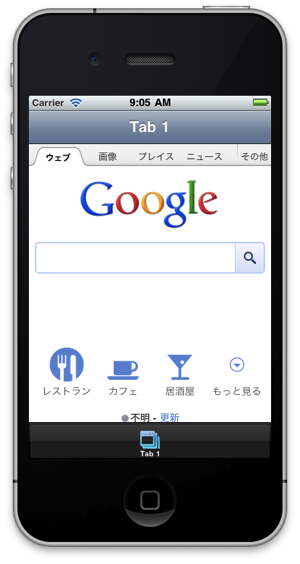

## WebViewを活用した簡易Webブラウザ開発

### WebViewとは？
WebKitブラウザ機能とほぼ同等の機能を持った部品です。

HTML5/CSS3ベースのHTMLコンテンツをほぼそのまま動作させることが可能で、指定したURLのHTMLコンテンツ表示やあらかじめ自分が作成したHTMLコンテンツの表示などを行うことができます

※WebKitとは：
WebブラウザのSafariにも標準搭載されるオープンソースソフトウェアでHTML、CSS、JavaScript等を解釈して画面描画を担当してます。


なお、WebViewの良い点としては、HTMLコンテンツが表示できるのでCSSと組み合わせることで細かいレイアウトを実現できる所があります。

しかしWebViewだけを使ったiPhoneアプリはアプリの審査基準ガイドラインの**12.3：Apps that are simply web clippings, content aggregators, or a collection of links, may be rejected**に該当する可能性あるかもしれないため、その点は念頭に置かれたほうがよいかと思います。


### 指定したURLを表示する機能の実装

プロジェクト設定完了後に作成されるapp.jsのソースコードの一部を改造して、指定したURLのサイトを表示できるようにします。

```javascript
var tabGroup,win1,tab1,webView;
Titanium.UI.setBackgroundColor('#000');
tabGroup = Titanium.UI.createTabGroup();
win1 = Titanium.UI.createWindow({  
    title:'Tab 1',
    backgroundColor:'#fff'
});
tab1 = Titanium.UI.createTab({  
    icon:'KS_nav_views.png',
    title:'Tab 1',
    window:win1
});

// WebViewを追加します
webView = Titanium.UI.createWebView({
	url:'http://www.google.co.jp'
});
win1.add(webView);

tabGroup.addTab(tab1);  
tabGroup.open();
```
上記ソースコードの入力が完了したらbuildして、iPhone Simulator上で以下のように表示されるか確認します



指定したURLを表示するために、Titanium Mobile のWebViewを利用します


### HTMLコンテンツ準備して表示

先程は、指定したURLを表示する機能を試しましたが今度はあらかじめ準備しておいたHTMLコンテンツを表示する機能を実装します

```javascript
var tabGroup,win1,tab1,htmlContents,webView;
Titanium.UI.setBackgroundColor('#000');
tabGroup = Titanium.UI.createTabGroup();
win1 = Titanium.UI.createWindow({  
    title:'Tab 1',
    backgroundColor:'#fff'
});
tab1 = Titanium.UI.createTab({  
    icon:'KS_nav_views.png',
    title:'Tab 1',
    window:win1
});
htmlContents =  
'<html>' +
    '<head>' +
      '<title>自分で準備したHTMLを表示</title>' +
    '</head>' +
    '<body>' +
      '<h1>自分でつくったHTMLコンテンツ表示する</h1>' +
      '<p>こんな感じでコンテンツが表示できます</p>' +
    '</body>' +
  '</html>';


webView = Titanium.UI.createWebView({
	html:htmlContents
});
win1.add(webView);

tabGroup.addTab(tab1);  
tabGroup.open();
```
上記をbuildすると以下の様になるかと思います


### 仕上げにWebサイトを表示出来る簡易Webブラウザを作成します

ここまでの内容を踏まえて、最後にWebサイトを表示出来る簡易Webブラウザを作成します

```javascript
var tabGroup,win1,tab1,urlBox,stopBtn,webView,actInd;
Titanium.UI.setBackgroundColor('#FFF');
tabGroup = Titanium.UI.createTabGroup();
win1 = Titanium.UI.createWindow({
   title:'簡易ブラウザ',
   backgroundColor:'#fff'
});
tab1 = Titanium.UI.createTab({
    icon:'KS_nav_views.png',
    title:'Tab 1',
    window:win1
});
// １．URLを入力できるテキストフィールドを準備
urlBox = Titanium.UI.createTextField({
  color:'#336699',
  top:10,
  left:10,
  width:200,
  height:30,
  hintText:'enter url',
  keyboardType:Titanium.UI.KEYBOARD_URL,
  returnKeyType:Titanium.UI.RETURNKEY_DEFAULT,
  autocapitalization: false,
  borderStyle:Titanium.UI.INPUT_BORDERSTYLE_ROUNDED
});
urlBox.addEventListener('blur',function(e){
  actInd.show();
  webView.url = e.value;
  webView.reload();
});
win1.add(urlBox);

// ２．読み込み処理を中止するボタンを準備
stopBtn = Ti.UI.createButton({
  title:'stop',
  top:10,
  left:220,
  width:60,
  height:30,
  systemButton:Titanium.UI.iPhone.SystemButton.STOP
});
stopBtn.addEventListener('click',function(e){
  webView.stopLoading();
  actInd.hide();
});
win1.add(stopBtn);
// ３．HTMLコンテンツを表示するためのWebViewを準備
webView = Titanium.UI.createWebView({
  top:50,
  left:0,
  width:'auto',
  height:'auto'
});
webView.addEventListener('beforeload',function(e){
  actInd.show();
});
webView.addEventListener('load',function(e){
  actInd.hide();
});
win1.add(webView);
// ４．「読み込み中」ということを示すためのActivityIndicatorを準備
actInd = Titanium.UI.createActivityIndicator({
  top:50,
  height:55,
  width:'auto',
  opacity:0.5,
  color:'#FFFFFF',
  backgroundColor:'#000',
  borderRadius:5,
  borderColor:'#000',
  font:{fontFamily:'Helvetica Neue', fontSize:13},
  message:' Loading...',
  style:Titanium.UI.iPhone.ActivityIndicatorStyle.PLAIN
});
win1.add(actInd);

tabGroup.addTab(tab1);
tabGroup.open();
```

