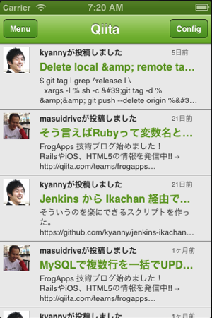

## はじめに




上記のようなTableViewの上に、ImageViewやLabelを多数配置したユーザインタフェースを開発する場合に、各オブジェクトの生成に関する記述が増える結果、ややコードの見通しがしづらくなるかと思います。

```javascript
var i ,len ,row ,rows,textLabel,iconImage,imagePath;
rows = [];
for (i = 0, len = 10; i < len; i++) {
  row = Ti.UI.createTableViewRow({
    width: Ti.UI.FULL,
    height:60,
    borderWidth: 0,
	className:'entry',
    color:"#222"
  });
  textLabel = Ti.UI.createLabel({
    width:250,
    height:30,
    top:5,
    left:60,
    color:'#222',
    font:{
      fontSize:16,
      fontWeight:'bold'
    },
    text:body[i].title
  });
  imagePath = body[i].user.profile_image_url;
  iconImage = Ti.UI.createImageView({
    width:40,
    height:40,
    top:5,
    left:5,
    defaultImage:"logo.png",
    image: imagePath
  });

  row.add(textLabel);
  row.add(iconImage);
  rows.push(row);
}

```

保守性や拡張性を意識したソースコードにしておくことで、開発したアプリを継続的に改善してくためのモチベーション維持に繋がるのではないかと思っているので、この章ではコード分割方法について解説します。
