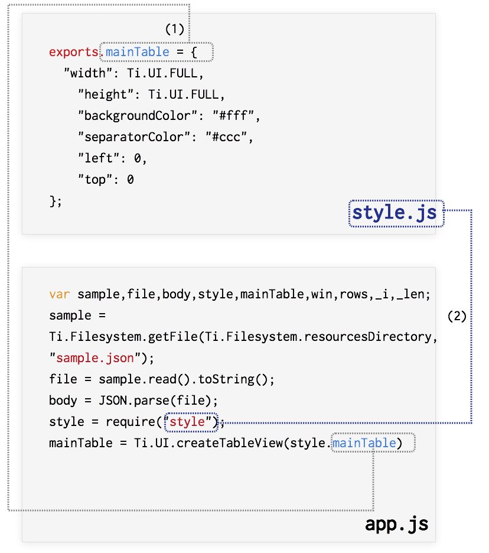

# CommonJSについて

TableViewの使い方について学ぶの[サンプルデータを表示させる](../../TitaniumClassic/tableview/tableView.html)のサンプルコードをベースにCommonJSスタイルの書き方について解説していきます。

Resources直下に、style.jsというファイルを新規に作成します。作成後は以下の様なフォルダ構成になるかと思います。
```sh
├── CHANGELOG.txt
├── LICENSE
├── LICENSE.txt
├── README
├── Resources
│   ├── KS_nav_ui.png
│   ├── KS_nav_views.png
│   ├── app.js
│   ├── iphone
│   └── style.js
├── build
│   └── iphone
├── manifest
└── tiapp.xml
```

## style.js の中身

style.js を以下のように記述することで、UI要素の幅、高さ、色などの値の設定箇けをapp.jsから切り離すことが出来ます。

```javascript
exports.mainTable = {
	"width": Ti.UI.FULL,
	"height": Ti.UI.FULL,
	"backgroundColor": "#fff",
	"separatorColor": "#ccc",
	"left": 0,
	"top": 0
};
exports.row = {
	"width": Ti.UI.FULL,
	"height":60,
	"borderWidth": 0,
	"className":"entry"
};

exports.textLabel = {
	"width":250,
	"height":50,
	"top":5,
	"left":60,
	"color":"#222",
	"font":{
		"fontSize":16,
		"fontWeight":"bold"
	}
};
```

## app.js を編集する

UI要素を生成する部分はstyle.jsにて行うようにしたことでapp.jsの方を編集する必要が出てきます。

具体的には

- app.js内で処理していたUI要素を生成する部分のコードは削除
- style.jsを読み込みこちらで設定した値をそれぞれのTi.UI要素に適用

という流れになります。

編集した結果以下の様なコードになります。

```javascript
var sample,file,body,style,mainTable,win,rows,_i,_len;
sample = Ti.Filesystem.getFile(Ti.Filesystem.resourcesDirectory, "sample.json");
file = sample.read().toString();
body = JSON.parse(file);
style = require("style");
mainTable = Ti.UI.createTableView(style.mainTable);
win = Ti.UI.createWindow({
  title:'QiitaViewer'
});
rows = [];
for (_i = 0, _len = body.length; _i < _len; _i++) {
  row = Ti.UI.createTableViewRow(style.row);
  textLabel = Ti.UI.createLabel(style.textLabel);
  textLabel.text = body[_i].title;
  row.add(textLabel);
  rows.push(row);
}
mainTable.setData(rows);
win.add(mainTable);
win.open();
```

## ソースコードの解説

style.jsとapp.jsの対応関係を絵にまとめつつソースコードの解説をします。



1. style.jsには、exports.オブジェクト名 = {} という形式で、UI要素に指定したい項目名を設定します。オブジェクト名は任意の名前でOKですが、対応関係がわかるようにして置いたほうがソースコードとして理解しやすくなるため名前を統一することをおすすめします。呼び出す側
2. app.jsからstyle.jsを読み込む時には、require()という関数を利用して任意の変数に格納します。

なおstyle.jsでは、

- exports.mainTable：app.jsでは変数**mainTable**として格納されてるTableViewに対する設定値
- exports.row：app.jsでは変数**row**として格納されてるTableViewRowに対する設定値
- exports.textLabel：app.jsでは変数**textLabel**として格納されてるTextLabelに対する設定値

という形になります。

このように設定情報だけを別のファイルにするだけでも比較的ソースコードの見通しが良くなりますが、次の項でもう少し踏み込んだ形でCommonJSスタイルの書き方を紹介します。
