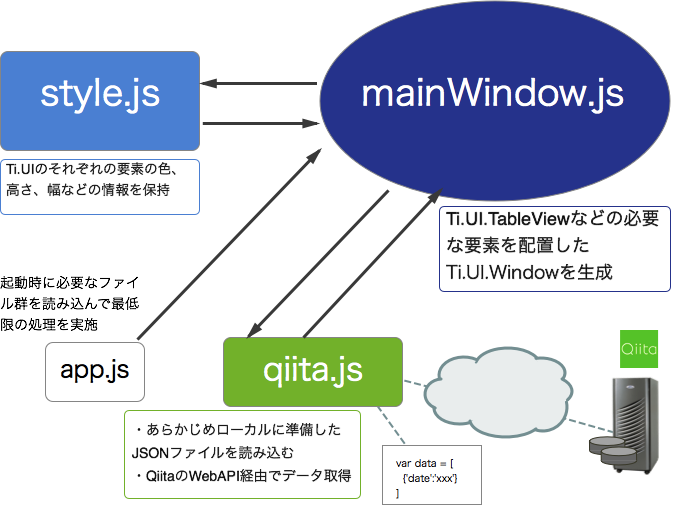

# データ取得処理も別ファイルにする

## はじめに

さきほどは、UI生成処理を別ファイルにしました。ソースコードの保守性をあげる最後の仕上げとして表示するデータ取得部分についても別のファイルに切り出します。

Resources直下に、qiita.jsというファイルを新規に作成します。作成後は以下の様なフォルダ構成になるかと思います。

```sh
├── CHANGELOG.txt
├── LICENSE
├── LICENSE.txt
├── README
├── Resources
│   ├── KS_nav_ui.png
│   ├── KS_nav_views.png
│   ├── app.js
│   ├── iphone
│   ├── mainWindow.js
│   ├── qiita.js
│   ├── sample.json
│   └── style.js
├── build
│   └── iphone
├── manifest
└── tiapp.xml
```


それぞれの役割を図にまとめると以下のようになります。




先ほど作成したstyle.js、mainWindow.jsはそのまま活用します。app.jsからデータ取得する部分を切り出して、その処理をqiita.jsに振り分けますが、以下にコードを示しながら順番に解説します。

## app.jsの役割

先程までは、あらかじめローカルに準備してあるsample.jsonを読み込む処理をapp.js内で実装していましたが、app.jsは、起動時に必要なファイル群を読み込むだけにしたいためこの処理を分割します。


### app.jsの中身

```javascript
var qiita,body,win,mainWindow;
qiita = require("qiita");     //(1)
body = qiita.getLocalJSON();  //(2)
mainWindow = require("mainWindow");
win = mainWindow.createWindow('Qiita Viewer',body);
win.open();
```

### app.jsのソースコード解説

1. データを読み込む処理をqiita.jsに実装しておりその機能を読み込みます。
2. qiita.jsで定義してるgetLocalJSON()関数を呼び出して、ローカルのsample.jsonを読み込みます。

## qiita.jsの役割

qiita.jsは、ローカルのsample.jsonを読み込む処理をgetLocalJSON()という関数として実装します。処理としてはapp.jsに記述していたコードをgetLocalJSON()にそのまま移動したような形になります。

### qiita.jsの中身

```javascript
exports.getLocalJSON = function(){
  var sample,file,body;
  sample = Ti.Filesystem.getFile(Ti.Filesystem.resourcesDirectory, "sample.json");
  file = sample.read().toString();
  body = JSON.parse(file);
  return body;
}; 
```

## qiita.jsを拡張する

ここまでの処理をふまえて、応用編としてqiita.jsを拡張してみましょう。

[取得したQiitaの投稿情報をTableViewを使って画面表示する](TitaniumClassic/httpclient/withTableView.html)で紹介したhttpCLientを活用してQiitaの投稿情報を取得する機能をqiita.jsに実装してみます。

具体的には呼び出す側のapp.jsから

- ローカルのsample.jsonを読み込む場合
- QiitaのWebAPIを通じて情報を取得する

という２つのことが出来ることを目指します

### qiita.jsを編集する

これまで作ったqiita.jsに、一部処理を加えます。

```javascript
exports.getLocalJSON = function(){
  var sample,file,body;
  sample = Ti.Filesystem.getFile(Ti.Filesystem.resourcesDirectory, "sample.json");
  file = sample.read().toString();
  body = JSON.parse(file);
  return body;
};
// 今回拡張する機能
exports.getItems = function(callback){
	var xhr,qiitaURL,method;
	qiitaURL = "https://qiita.com/api/v1/items";
	method = "GET";
	xhr = Ti.Network.createHTTPClient();
	xhr.open(method,qiitaURL);
	xhr.onload = function(){
		var body;
		if (this.status === 200) {
			body = JSON.parse(this.responseText);
			callback('ok',body);
		} else {
			Ti.API.info("error:status code is " + this.status);
		}
	};
	xhr.onerror = function(e) {
		var error;
		error = JSON.parse(this.responseText);
		Ti.API.info(error.error);
	};
	xhr.timeout = 5000;
	xhr.send();
};
```

### 拡張した処理の解説

上記の中でポイントになる箇所だけ抜粋します

```javascript
exports.getItems = function(callback){    // (1)
  xhr.onload = function(){
  var body;
  if (this.status === 200) {              // (2)
    body = JSON.parse(this.responseText);
    callback('ok',body);                  // (3)
  }
  //  以下省略 
};
```

1. 通信処理が成功した場合に、取得した投稿情報を次の処理に渡したいためその処理名の引数を設定します。
2. 通信が成功したかどうか判定するために、this.statusの値をチェックします。statusの値が200の場合には処理が成功してるのでそれ以降の処理を実行します。
3. 引数callbackに、2つの値を渡します

## まとめ

- UIを生成する処理をmainWindow.jsで定義
- データ取得する部分の処理をqiita.jsに定義
- app.jsは上記２つを連携する処理に特化

というように役割毎にファイルを分割することで、構造として理解しやすくなり、結果としてソースコードの見通しがよくなると思います。

TitaniumのClassicの環境でもこのようにファイルに分割することで、後述するAlloyを利用したアプリケーション開発にもスムーズに着手できるようになるかと思いますのでこのような形で役割毎にファイル分割して開発していくことをおすすめします。
