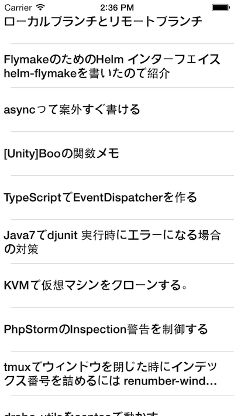
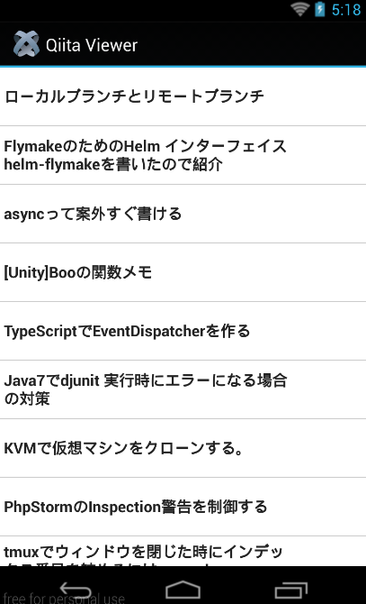

# UI生成処理を別ファイルにする

## はじめに

先程は設定情報だけを別のファイルにする方法を解説しましたが、現実にはこういう形よりも、画面単位で処理を分割するアプローチの方がより使い勝手の良いものになるので具体的にその方法についてサンプルコードを示しながら解説をしてきます。

## ウィンドウを生成するためのファイルを作成する

Resources直下に、mainWindow.jsというファイルを新規に作成しします。

作成後は以下の様なフォルダ構成になるかと思います。

```sh
├── CHANGELOG.txt
├── LICENSE
├── LICENSE.txt
├── README
├── Resources
│   ├── KS_nav_ui.png
│   ├── KS_nav_views.png
│   ├── app.js
│   ├── iphone
│   ├── mainWindow.js
│   ├── sample.json
│   └── style.js
├── build
│   └── iphone
├── manifest
└── tiapp.xml
```

それぞれのファイルの役割は以下のようになります。

- app.js
    - 起動時に必要なファイル群を読み込んで最低限の処理を実施
- mainWindow.js
    - Ti.UI.TableViewなどの必要な要素を配置したTi.UI.Windowを生成するファイル
- style.js
    - Ti.UIのそれぞれの要素の色、幅、高さなどの設定値を保持してるファイル


先ほど作成したstyle.jsはそのまま活用しているのでそちらのソースコードと説明は割愛します。

app.jsとmainWindow.jsのコードを示しながら順番に解説します。

## app.jsの役割

Titanium Mobileの新規プロジェクト作成時に出来上がるひな形となるapp.jsでは1つのフィアル内で色々な処理が実施されていましたが、今回のようにいくつかの処理単位にファイルに分割することで、app.jsは、起動時に必要なファイル群を読み込むだけの最低限の処理を行うだけの役割にします。

### app.jsの中身

```javascript
var sample,file,body,win,mainWindow;
sample = Ti.Filesystem.getFile(Ti.Filesystem.resourcesDirectory, "sample.json");
file = sample.read().toString();
body = JSON.parse(file);
mainWindow = require("mainWindow");                  //(1)
win = mainWindow.createWindow('Qiita Viewer',body);  //(2)
win.open();
```

### app.jsのソースコード解説

1. Ti.UI.Windowを生成する処理をmainWindow.jsに処理をわけているので、そのファイルを読み込む
2. mainWindow.jsにて定義してるcreateWindow()関数に必要な引数を渡してTi.UI.Windowを生成。生成されたオブジェクトは変数winに格納


## mainWindow.jsの役割

それぞれのUI要素が配置されたTi.UI.Windowを生成して最終的にそのTi.UI.Windowを値とし返してます。

先ほど作ったstyle.jsと少し異なる部分があるのでそこを掘り下げて解説します


### mainWindow.jsの中身

```javascript
exports.createWindow = function(windowTitle,items){
	var style,mainTable,win,rows,_i,_len,row,textLabel;
	style = require("style");
	mainTable = Ti.UI.createTableView(style.mainTable);
	win = Ti.UI.createWindow({
		title:windowTitle
	});
	rows = [];
	for (_i = 0, _len = items.length; _i < _len; _i++) {
		row = Ti.UI.createTableViewRow(style.row);
		textLabel = Ti.UI.createLabel(style.textLabel);
		textLabel.text = items[_i].title;
		row.add(textLabel);
		rows.push(row);
	}
	mainTable.setData(rows);
	win.add(mainTable);
	return win;
};
```

上記の中でポイントになる箇所だけ抜粋します

```javascript
exports.createWindow = function(windowTitle,items){ // (1)
  var win;
  win = Ti.UI.createWindow({
    //省略
  });
  return win;                                       // (2)
};
```
1. exports.関数名 = function(引数名){} という形にすることで、外部からここで定義された関数を実行することが出来ます。（今回のサンプルではcreateWindowというのが関数名になります）
2. 関数内でTi.UI.Windowを生成して必要な要素を追加して最後に、return win とすることで、変数winに格納されたTi.UI.Windowを得ることが出来ます。このreturn winの一行をいれないと、呼び出し側からは、生成したTi.UI.Windowが得られず、何も表示されなくなるので注意が必要です


## 実行結果

iPhone、Androidでの実行結果はそれぞれ以下のようになります。

### iPhoneでの実行イメージ



### Androidでの実行イメージ



## まとめ

UI生成処理を別ファイルにする方法についてまとめました。ソースコードの保守性をあげるためにもう一工夫出来る所があるので、その点について次の項で説明します
