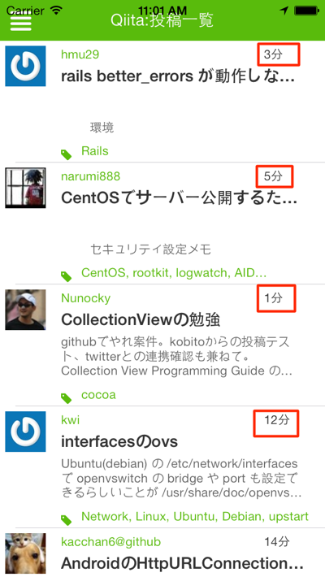
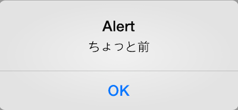
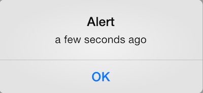
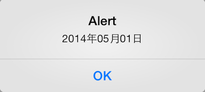

# 日付処理を便利に行えるMoment.js

## はじめに

WebAPIと連携するアプリケーションで以下のようにタイムラインビューを持ったユーザインタフェースの場合に、以下画面の赤枠で囲った部分のように**何分前に投稿された情報なのか**すぐにわかるようになってるケースが多いかと思います。



QiitaのWebAPIでは、xx分前の情報かわかるような項目がすでに準備されているため、その値を表示するだけで済むのですが、必ずしも全てのWebAPIがこのようになってるとは限らず、**2014/04/15 12:34:56**というような形式でデータが返ってくる事のほうが主流かと思います。

もしも、**2014/04/15 12:34:56**という形式のものをxx分前という形式に変更する場合には、現在の時刻の差分を計算してという処理を自分で書く必要が出てきます。

Titanium Mobileでは、CommonJSスタイルで書かれたJavaScriptのライブラリはそのまま活用できることが多く、こういう日付処理に向いたライブラリとして、[Moment.js](http://momentjs.com/)というものがあるのでそれを組み込むことで、面倒な日付計算が簡単にできるので、その紹介をします。

## Moment.jsを利用するための事前準備

[Moment.js](http://momentjs.com/) のサイトからMinifiedされたファイルをダウンロードします。


ファイル名を**moment.min.jsからmoment.js**に変更します。

デフォルトは英語表記なのですが、i18n（internationalization。国際化）対応しているので、日本語表記をした別ファイルを準備することで手軽に日本語化も出来ます。[株式会社ジーティーアイ](http://gti.jp)の佐藤　毅 さんという方が作成した[moment.lang_ja.js](http://gti.jp/ajax/livestamp/moment.lang_ja.js)をダウンロードして利用します。

なお、moment.lang_ja.jsのファイル名だと手元の環境では、require()で読み込めなかったので**momentja.js**という形にリネームして利用します。

プロジェクト直下のフォルダが以下のようなディレクトリ構造になります

```sh
.
├── CHANGELOG.txt
├── LICENSE
├── LICENSE.txt
├── README
├── Resources
│   ├── android
│   ├── app.js
│   ├── iphone
│   ├── mainWindow.js
│   ├── moment.js
│   ├── momentja.js
│   ├── qiita.js
│   └── style.js
├── build
│   ├── android
│   ├── iphone
│   └── tishadow
├── manifest
└── tiapp.xml
```

## Moment.jsの例

Moment.js使った簡易のサンプルをまずは紹介します。

app.jsの中身を一旦削除して以下を記述します

```javascript
var moment,momentja,time1,time2;
moment = require("moment");
momentja = require("momentja");
time1 = moment().fromNow();
time2 = moment().format('YYYY年mm月DD日');
alert(time1);
alert(time2);
```

実行するとtime1、time2のそれぞれの実行結果が画面に表示されます。

### time1の実行結果

momentを読み込んだ後に、momentjaを読み込んで日本語化されてるため、以下のように表示されます。



もしも、日本語表記ではなく、英語表記にしたい場合にはmomentjaを読み込まず以下のようにすることで期待される結果が得られます

```javascript
var moment,nonLocalizeTime;
moment = require("moment");
nonLocalizeTime = moment().fromNow();
alert(nonLocalizeTime);
```


### time2の実行結果

moment().format()のようにすることで、任意の日付形式で表示できます。format()を利用する際に任意の引数を指定することで意図した値が得られます。

今回のサンプルでは**YYYY年mm月DD日**としてるので、以下のような結果になります。



次の項ではWebAPIから取得した値をMoment.jsを使って任意の日付に変換して画面表示するサンプルアプリケーションの解説をしてきます。
