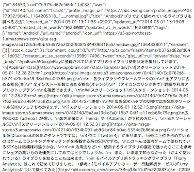
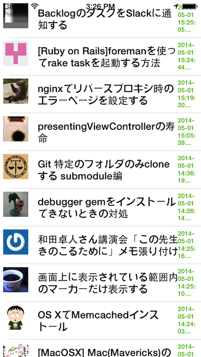
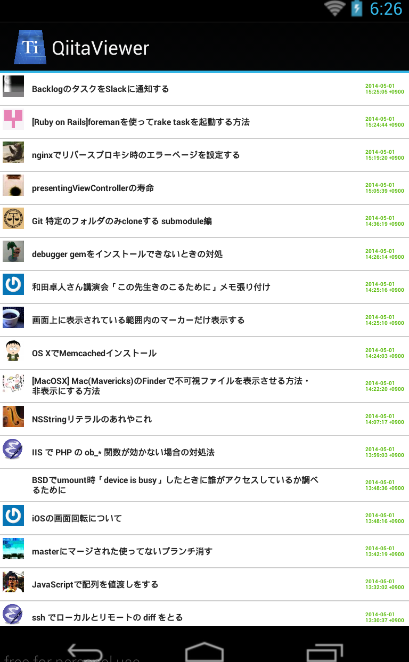
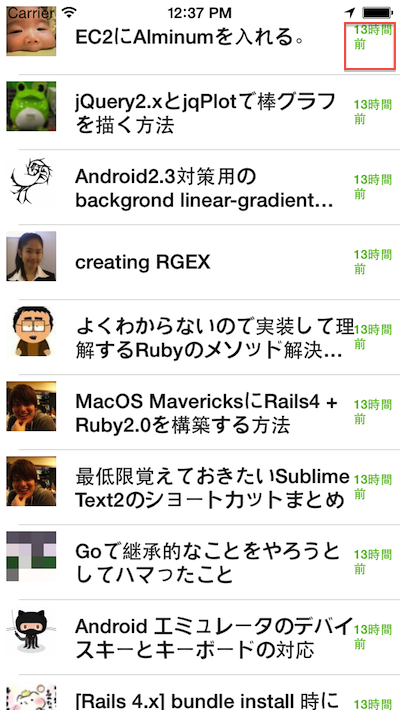
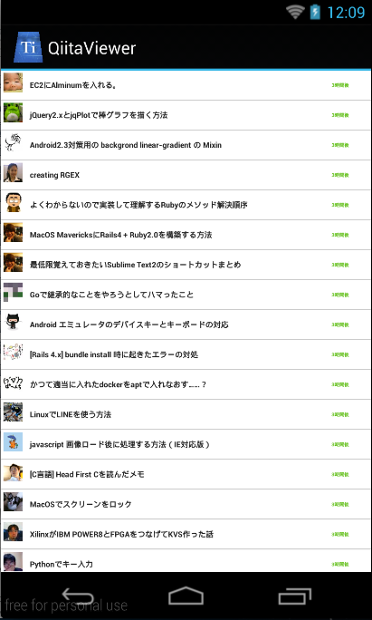

# QiitaのWebAPIと連携させるアプリでMoment.jsを使う

## はじめに

先ほどMoment.jsの概要を解説しましたので、QiitaのWebAPIと連携させるアプリでMoment.jsを使ったサンプルアプリの解説をします。

## QiitaのWebAPIの投稿情報の日付データの扱いについて

QiitaのWebAPIでは、xx分前の情報かわかるような項目がすでに存在すると前の項で解説しましたが、例えば、投稿IDがb375ad62efd64c11d032の情報を例にします。

この投稿情報をWebAPI経由で取得するにはブラウザ上で

[https://qiita.com/api/v1/items/b375ad62efd64c11d032](https://qiita.com/api/v1/items/b375ad62efd64c11d032)

にアクセスすると、JSON形式の値が返ってきます。



このデータの以下の項目がそれぞれxx分前の情報に該当します。

- created_at_in_words
    - 8分
- updated_at_in_words
    - 1分未満

上記値を参照すれば、xx分前という表示は簡単に出来ますが、今回はあえてその項目を利用せず、以下を利用します。

- 作成日：**created_at**という項目を参照
    - 参照した結果例：2014-05-01 13:11:36 +0900
- 更新日：**updated_at**という項目
    - 参照した結果例：2014-05-01 13:19:09 +0900

以下サンプルアプリでは、上記2つのうち、作成日である created_at の項目を参照することにします。


## まずは投稿情報の作成日を画面に表示する

これまで作ってきたアプリケーションをベースにまずは投稿情報の作成日を画面に表示する機能の実装を行います。app.js、qiita.jsは基本的には変更ないので、コードだけ以下記載します。

### app.js

```javascript
var mainWindow,win;

mainWindow = require("mainWindow");
win = mainWindow.createWindow();	
win.open();		
```

### qiita.js

```javascript
exports.getItems = function(callback){
	var xhr,qiitaURL,method;
	qiitaURL = "https://qiita.com/api/v1/items";
	method = "GET";
	xhr = Ti.Network.createHTTPClient();
	xhr.open(method,qiitaURL);
	xhr.onload = function(){
		var body;
		if (this.status === 200) {
			body = JSON.parse(this.responseText);
			Ti.API.info("number is :" + body.length);
			callback('ok',body);
		} else {
			Ti.API.info("error:status code is " + this.status);
		}
	};
	xhr.onerror = function(e) {
		var error;
		error = JSON.parse(this.responseText);
		Ti.API.info(error.error);
	};
	xhr.timeout = 5000;
	xhr.send();
};

```

### mainWindow.js

投稿情報の作成日を画面に表示するため、ここはいくつか修正あります。


```javascript
exports.createWindow = function(){
	var win = Ti.UI.createWindow({
		title:"QiitaViewer"
	});
	
	// 起動時にWebAPIからデータを取得して投稿情報が取得できたらmainTableにセット

	getQiitaItems(function(){
		Ti.API.info("起動時にWebAPIからデータを取得しました");
	});
	win.add(mainTable);
	win.add(actInd);
	return win;
};

var style = require("style"),
    mainTable = Ti.UI.createTableView(style.mainTable),
    actInd = Ti.UI.createActivityIndicator(style.actInd),
    qiita = require("qiita");

function getQiitaItems(callback){
	var rows;
	if (Ti.Network.online === false){
		alert("利用されてるスマートフォンからインターネットに接続できないため情報が取得できません");
	} else {
		actInd.show();
		qiita.getItems(function(status,items){
			rows = createRows(items);
			mainTable.setData(rows);
			actInd.hide();
			return callback();
		});
	}
	
};
function createRows(items){
	var rows = [],_i,_len,style = require("style"),row,textLabel,createdTimeLabel,iconImage;
	for (_i = 0, _len = items.length; _i < _len; _i++) {
		  row = Ti.UI.createTableViewRow(style.row);
		  textLabel = Ti.UI.createLabel(style.textLabel);
          createdTimeLabel = Ti.UI.createLabel(style.createdTimeLabel); // (1)
          createdTimeLabel.text =  items[_i].created_at;                // (2)
		  iconImage = Ti.UI.createImageView(style.iconImage);
		  iconImage.image = items[_i].user.profile_image_url;
		  textLabel.text = items[_i].title;
		  row.add(textLabel);
		  row.add(iconImage);
		  row.add(createdTimeLabel);                                    // (3)
		  rows.push(row);
	}
	return rows;
};
```

1. 投稿情報の作成日を表示するためのTi.UI.Labelを生成
2. 上記生成したTi.UI.Labelに投稿情報の作成日を表示させるため、textプロパティにQiitaのWebAPI経由で取得した値（items[_i].created_at）を代入します
3. 生成したTi.UI.LabelをTableViewRowに追加します


### style.js


- 作成日のラベルに対応するスタイル設定追加
- iPhoneとAndroidとで同じようなレイアウトにするためTableViewに配置するそれぞれのTi.UI.Label要素の幅をパーセンテージにて設定するように修正

を行うためにいくつか修正してます。


```javascript
exports.mainTable = {
    "width": Ti.UI.FULL,
    "height": Ti.UI.FULL,
    "backgroundColor": "#fff",
    "separatorColor": "#ccc",
    "left": 0,
    "top": 0
};
exports.row = {
    "width": Ti.UI.FULL,
    "height":60,
    "borderWidth": 0,
    "className":"entry"
};
exports.iconImage = {
	top:5,
	left:5,
	width:40,
	height:40
};
exports.textLabel = {
    "width":"70%",
    "height":50,
    "top":5,
    "left":60,
    "color":"#222",
    "font":{
        "fontSize":16,
        "fontWeight":"bold"
    }
};
exports.createdTimeLabel = {
    "width":"10%",
    "height":50,
    "bottom":5,
    "right":5,
    "color":"#59BB0C",
    "font":{
        "fontSize":10,
        "fontWeight":"bold"
    }
};

exports.actInd = {
    top:"20%",
    left:"30%",
    height:Ti.UI.SIZE,
    width:Ti.UI.SIZE,
    zIndex:0,
    color: "#f9f9f9",
    backgroundColor:"#444",
    font: {
        fontFamily:'Helvetica Neue',
        fontSize:16,
        fontWeight:'bold'
    },
    message: 'Loading...',
    style:Ti.UI.iPhone.ActivityIndicatorStyle.DARK
};

```

## 実行した結果


### iPhone



### Android



## Moment.jsを使って投稿情報の作成日を任意の形式に変更する

投稿情報の作成日を画面に表示する機能を実装したので、今度はMoment.jsを使って日付の表示方法を変更します。

修正するのは、mainWindow.jsのcreateRows関数の所だけです

```javascript
// 一部分だけ抜粋
function createRows(items){
	var rows = [],_i,_len,style = require("style"),row,textLabel,createdTimeLabel,iconImage,moment = require("moment"),momentja = require("momentja");   // (1)
	for (_i = 0, _len = items.length; _i < _len; _i++) {
		  row = Ti.UI.createTableViewRow(style.row);
		  textLabel = Ti.UI.createLabel(style.textLabel);
          createdTimeLabel = Ti.UI.createLabel(style.createdTimeLabel);
          createdTimeLabel.text = moment(items[_i].created_at).fromNow(); // (2)
		  iconImage = Ti.UI.createImageView(style.iconImage);
		  iconImage.image = items[_i].user.profile_image_url;
		  textLabel.text = items[_i].title;
		  row.add(textLabel);
		  row.add(iconImage);
		  row.add(createdTimeLabel);
		  rows.push(row);
	}
	return rows;
};
```
1. Moment.js＆日本語化表示のために、必要なファイルの読み込みを行う記述を追加します
2. QiitaのWebAPIの投稿情報が格納されてれるitems[_i].created_atの日付データを変換するために、moment()の引数にitems[_i].created_atを渡します。

## 実行結果

iPhone、Androidでの実行結果は以下のようになります。

### iPhone



### Android




Moment.jsの公式サイトにある利用方法のドキュメントは英語のみですが表記方法のサンプルがいくつか紹介されてるので、一読するのをオススメします。

[http://momentjs.com/docs/#/displaying/](http://momentjs.com/docs/#/displaying/)
