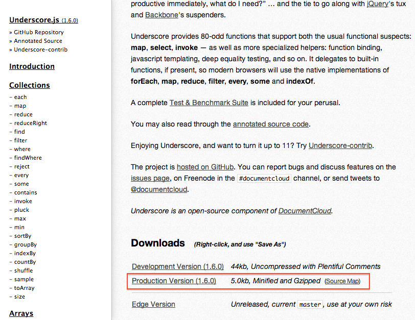
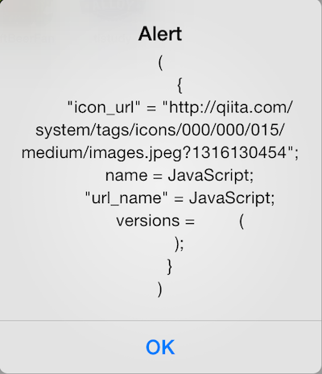
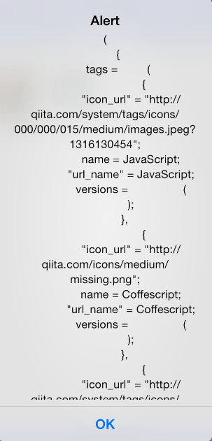

# 配列操作を便利に行えるUnderscore.js

## はじめに

WebAPI経由で取得出来るデータ形式は、以下の様なJSON形式のものが一般的かと思います

```javascript
[{"id":66066,"uuid":"43b07b9fc7986a2e4f01","user":{"id":43378,"url_name":"tfunato","profile_image_url":"https://avatars.githubusercontent.com/u/69743?"},"title":"HadoopのJob設定時のConfigurationの注意点","created_at":"2014-05-08 04:03:21 +0900","updated_at":"2014-05-08 04:03:21 +0900","created_at_in_words":"約7時間","updated_at_in_words":"約7時間","tags":[{"name":"hadoop","url_name":"hadoop","icon_url":"https://s3-ap-northeast-1.amazonaws.com/qiita-tag-image/ef39105194a4c3253540f491d5e2186650033493/medium.jpg?1364839136","versions":["1.2.1"]}],"stock_count":3,"comment_count":0,"url":"http://qiita.com/tfunato/items/43b07b9fc7986a2e4f01","created_at_as_seconds":1399489401,"tweet":false,"gist_url":null,"private":false},{..}]
```

取得したデータに対して、例えば2014年xx月xx日：xx 件、2014年xx月xx日：xx 件・・というように投稿日別にグループ化したいとか、該当の条件にマッチするものだけ表示したいといった処理が必要になるケースが出てきます。

Underscore.jsというライブラリを導入することで、上記のような処理を比較的簡単に実現できるので、その方法について解説します

## Underscore.jsを利用するための事前準備

[Underscore.js](http://underscorejs.org/)のサイトから[Minifiedされたものを](http://underscorejs.org/underscore-min.js)をダウンロードします。



Titanium のプロジェクトフォルダのResouces直下に配置します。

最終的に以下のようなフォルダ構成になればOKです

```sh
.
├── CHANGELOG.txt
├── LICENSE
├── LICENSE.txt
├── README
├── Resources
│   ├── android
│   ├── app.js
│   ├── iphone
│   └── underscore-min.js
├── build
│   ├── android
│   └── iphone
├── manifest
└── tiapp.xml
```

## Underscore.jsを使ってみる

Underscore.js使った簡易のサンプルをまずは紹介します。


```javascript
var tags = [
      {
        "name":"JavaScript","url_name":"JavaScript","icon_url":"http://qiita.com/system/tags/icons/000/000/015/medium/images.jpeg?1316130454","versions":[]
      },{
        "name":"Coffescript","url_name":"Coffescript","icon_url":"http://qiita.com/icons/medium/missing.png","versions":[]
      },{
        "name":"Qiita","url_name":"Qiita","icon_url":"http://qiita.com/system/tags/icons/000/000/001/medium/favicon.png?1320171109","versions":[]
      },{
        "name":"Zsh","url_name":"Zsh","icon_url":"http://qiita.com/system/tags/icons/000/000/041/medium/zsh.jpg?1319819723","versions":[]
      },{
        "name":"Github","url_name":"Github","icon_url":"http://qiita.com/system/tags/icons/000/000/090/medium/Octocat.jpg?1320170917","versions":[]
      }
    ];
```

上記データに対して、特定のタグにマッチする、具体的には、tagsのnameプロパティがJavaScriptのものだけを抽出したいというような処理を行いたい場合に、Underscore.jsのwhere()を利用することで手軽に実現できます。

### ソースコード

app.jsの中身を一旦削除して以下を記述します。

```javascript
var _ ,tags;
_ = require("underscore-min");
tags = [
  {
    "name":"JavaScript","url_name":"JavaScript","icon_url":"http://qiita.com/system/tags/icons/000/000/015/medium/images.jpeg?1316130454","versions":[]
  },{
    "name":"Coffescript","url_name":"Coffescript","icon_url":"http://qiita.com/icons/medium/missing.png","versions":[]
  },{
    "name":"Qiita","url_name":"Qiita","icon_url":"http://qiita.com/system/tags/icons/000/000/001/medium/favicon.png?1320171109","versions":[]
  },{
    "name":"Zsh","url_name":"Zsh","icon_url":"http://qiita.com/system/tags/icons/000/000/041/medium/zsh.jpg?1319819723","versions":[]
  },{
    "name":"Github","url_name":"Github","icon_url":"http://qiita.com/system/tags/icons/000/000/090/medium/Octocat.jpg?1320170917","versions":[]
  }
];

alert(_.where(tags,{name:"JavaScript"}));
```
上記実行すると、以下の様になるかと思います。




### ソースコードの解説

キモになる所のソースコードを以下抜粋して実際の処理内容を解説します。

まず、Underscore.jsを利用するために、以下のようにしてファイルを読み込みます。読み込んだファイルを変数に格納しますが、変数名を _（アンダースコアー）にするのが通例のようなのでそれにならって以下のようにします。

```javascript
_ = require("underscore-min");
```

次に、以下のUnderscore.jsのwhere()の部分について解説します。

```javascript
alert(_.where(tags,{"name":"JavaScript"}));
```

where()は2つ引数を取ります。

_.where(<1>,{<2>})

1. 最初の引数は、検索対象となる配列を渡します。今回は tags = [{},{}...]というものが対象になるため、最初の引数をtagsとしてます。
2. 次の引数ですが、検索条件となるものを、key-valueの形式で渡します。今回はnameプロパティがJavaScriptのものだけを抽出したいため、{name:"JavaScript"}という形になります。

## QiitaのWebAPIから得られるデータで特定のタグにマッチするものだけ抽出する

上記解説時に利用したサンプルのJSON形式のデータのようなシンプルな構造のケースは少なく、実際にQiitaのWebAPIから得られる形式は、以下のようにオブジェクトが入れ子になってます。

```javascript
var result = [
  {
    "uuid":"88194612bb0fa705e39d",
    "tags":[
      {
        "name":"JavaScript","url_name":"JavaScript","icon_url":"http://qiita.com/system/tags/icons/000/000/015/medium/images.jpeg?1316130454","versions":[]
      },{
        "name":"Coffescript","url_name":"Coffescript","icon_url":"http://qiita.com/icons/medium/missing.png","versions":[]
      },{
        "name":"Qiita","url_name":"Qiita","icon_url":"http://qiita.com/system/tags/icons/000/000/001/medium/favicon.png?1320171109","versions":[]
      }
    ]
  },
  {
    "uuid":"542e652b73a359a1d118",
    "tags":[
      {
        "name":"Zsh","url_name":"Zsh","icon_url":"http://qiita.com/system/tags/icons/000/000/041/medium/zsh.jpg?1319819723","versions":[]
      },{
        "name":"Github","url_name":"Github","icon_url":"http://qiita.com/system/tags/icons/000/000/090/medium/Octocat.jpg?1320170917","versions":[]
      }
    ]
  }
];
```

こういうデータ構造になってるものに対して、先ほどと同様にtagsのnameプロパティがJavaScriptのものだけを抽出したいというような処理を行う場合には一工夫した上でUnderscore.jsのwhere()を利用する必要がありますので、その方法について以下解説します。

## オブジェクトが入れ子になったデータに対する処理の概要

まずはソースコードを以下に示します。

```javascript
var _ = require("underscore-min");
var result = [
  {
    "uuid":"88194612bb0fa705e39d",
    "tags":[
      {
        "name":"JavaScript","url_name":"JavaScript","icon_url":"http://qiita.com/system/tags/icons/000/000/015/medium/images.jpeg?1316130454","versions":[]
      },{
        "name":"Coffescript","url_name":"Coffescript","icon_url":"http://qiita.com/icons/medium/missing.png","versions":[]
      },{
        "name":"Qiita","url_name":"Qiita","icon_url":"http://qiita.com/system/tags/icons/000/000/001/medium/favicon.png?1320171109","versions":[]
      }
    ]
  },
  {
    "uuid":"542e652b73a359a1d118",
    "tags":[
      {
        "name":"Zsh","url_name":"Zsh","icon_url":"http://qiita.com/system/tags/icons/000/000/041/medium/zsh.jpg?1319819723","versions":[]
      },{
        "name":"Github","url_name":"Github","icon_url":"http://qiita.com/system/tags/icons/000/000/090/medium/Octocat.jpg?1320170917","versions":[]
      }
    ]
  }
];

matchTag(result,"JavaScript");

function matchTag(items, tagName) {
  var i, tags, value, _, result = [] ;
  for (i=0;i<items.length;i++) {
    tags = items[i].tags;
    _ = require("underscore-min");
    value = _.where(tags, {
      "url_name": tagName
    });
    if(value){
      result.push(items[i]);
    }
  }
  return result;
};
```

実行すると以下の様な画面が表示されます。



### ソースコードの解説

今回のようなオブジェクトが入れ子構造になってるものに対して

```javascript
alert(_.where(result,{name:"JavaScript"}));
```

としても、検索対象のresultの直下には**uuid**と**tags**というプロパティしか存在しないため意図したような検索結果が得られません。

```javascript
var result = [
  {
    "uuid":"88194612bb0fa705e39d",
    "tags":[]
  },{
    "uuid":"542e652b73a359a1d118",
    "tags":[]
  }
]
```

今回のように、tagsプロパティ内の配列を検索対象にする場合、まずはresult配列に対してループ処理をして、result内部のオブジェクト１つ１つにアクセスします。


```javascript
for (i=0;i<items.length;i++) {
  // ループして１つ１つのオブジェクトにアクセスする
  tags = items[i].tags;

}    
```


そして、アクセスしたオブジェクトのtagsに対してwhere()を適用してtagsのnameプロパティが該当のものにマッチした場合には、valueに値を格納します。

```javascript
for (i=0;i<items.length;i++) {
  // ループして１つ１つのオブジェクトにアクセスする
  tags = items[i].tags;
  _ = require("underscore-min");
  // アクセスしたオブジェクトのtagsに対してwhere()を適用
  value = _.where(tags, {
    "url_name": tagName
  });
}
```

そして、valueの値をチェックして該当のタグにマッチするオブジェクトの場合には、この関数内で利用する配列resultに格納しておきます。

### 実際の処理結果の概要

uuidの値が**88194612bb0fa705e39d**のtagsには
```javascript
"tags":[
  {
    "name":"JavaScript",//省略
  },
  {
    "name":"Coffescript",//省略
  },
  {
    "name":"Qiita",//省略
  }
]
```
となってるのでこちらは条件にマッチします。

一方でてuuidの値が**542e652b73a359a1d118**のtagsには

```javascript
"tags":[
  {
    "name":"Zsh",//省略
  },
  {
    "name":"Github",//省略
  }
]
```

なのでこちらはマッチしないため、alert()で表示されません。

この内容を踏まえて、QiitaのWeb APIから取得したデータに対して2014年xx月xx日：xx 件、2014年xx月xx日：xx 件・・というように投稿日別にグループ化するサンプルアプリケーションについて紹介します。
