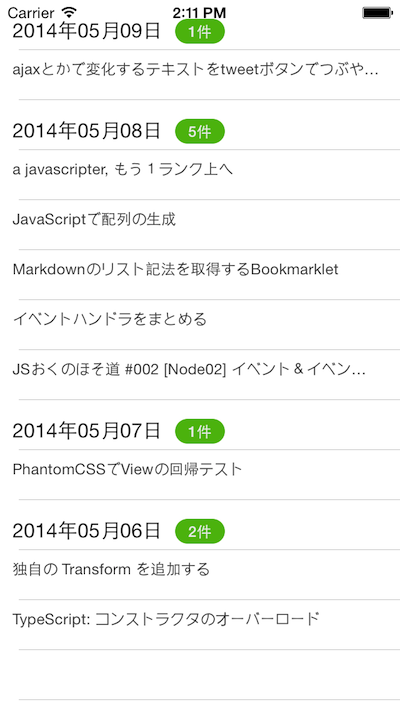

# QiitaのWeb APIから取得したデータを投稿日別にグループ化して表示

## はじめに

QiitaのWeb APIから取得したデータに対して

- 2014年xx月xx日：xx 件
- 2014年xx月xx日：xx 件

というように投稿日別にグループ化する以下の様なサンプルアプリケーションについて紹介します。

## 開発前の事前準備

説明の都合上、QiitaのWebAPI経由で取得したJSON形式のデータをあらかじめ準備してあります。

