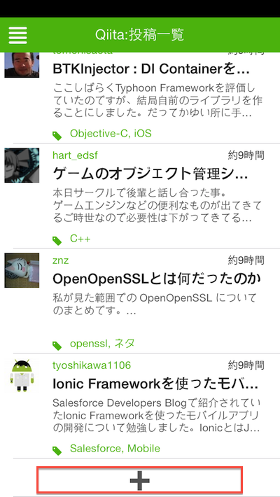
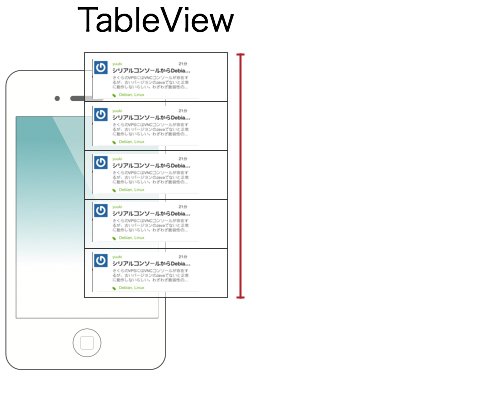
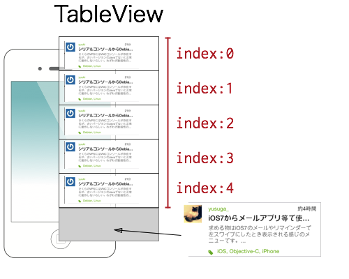
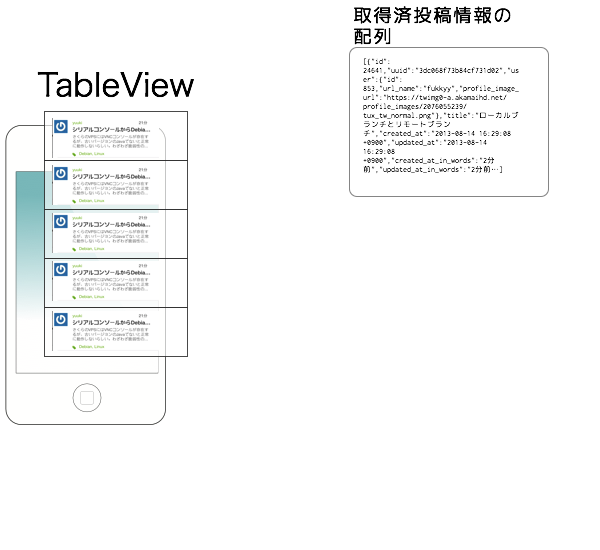
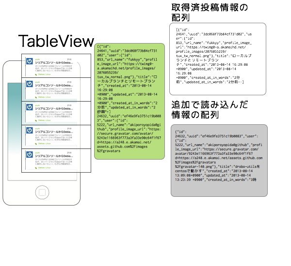
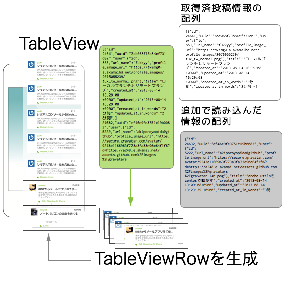
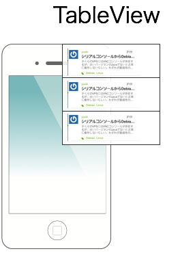
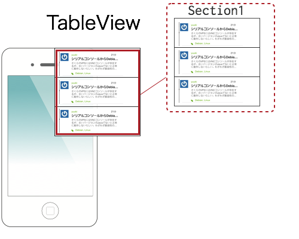
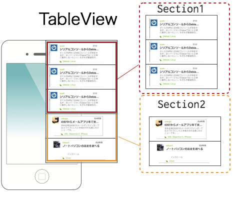

# スクロールしたら追加の情報を読み込む:アイデア編

## はじめに

私が作ったTiQiitaのユーザーインターフェースでは画面下部までスクロールしたら、追加の投稿情報を読み超えるようにボタンを配置してます。(以下キャプチャーの赤枠で囲った部分）

タイムラインのようなユーザインタフェースを持ったアプリケーションではこういう追加で読み込む処理は必須なものかと思いますが、Titanium Mobileでこれを実現する方法について解説します

## 実装方法のアイデア

TableViewを使って情報の追加を行う場合にいくつかのアプローチが考えられそうです。

- [TableViewにあるInsertRowAfterメソッド](http://docs.appcelerator.com/titanium/3.0/#!/api/Titanium.UI.TableView-method-insertRowAfter)を使い、最後のRowの後に１つづつRowを追加する

- すでに取得した投稿情報を何らかの形でローカルにキャッシュしておき、追加で読み込んだ情報と結合して[TableViewにあるSetDataメソッド](http://docs.appcelerator.com/titanium/3.0/#!/api/Titanium.UI.TableView-method-setData)を使い、TableViewのRowのデータを全て再更新する

- WebAPIにアクセスする度に[TableViewSection](http://docs.appcelerator.com/titanium/3.0/#!/api/Titanium.UI.TableViewSection)を作成して処理をする

上記３点についてどういう実装イメージになるのか以下に図解します。

### TableViewにあるInsertRowAfterメソッドを活用するイメージ

現在のRowの件数を調べる

Rowの件数−１をした所が最後のindexになるのでそれを取得した上でinsertRowAfterの引数にそのindex値を指定する。

### TableViewにあるSetDataメソッドを活用

起動時に取得した投稿情報を何らかの形でローカルにキャッシュする

追加で読み込んだ情報の配列と既存の情報の配列を結合する

結合した情報を１件づつ読み込みながらTableViewRowを作成しRowのデータを配列に格納する

setData()で③で生成した配列を指定してTableViewを再描画する

### TableViewSectionで投稿情報別に区切るイメージ

まず、起動時に投稿情報を読み込みTableViewを作成

※TableView作成する際には、TableViewSectionを作成しそこに順番にRowを追加して最初の投稿情報を処理するイメージです。

追加で読み込んだ情報は別途TableViewSectionを生成してそこに順番にRowを追加したものを、最初のSectionの後に挿入します。

この段階での処理イメージとしては、投稿情報表示するTableViewには２つのTableViewSectionがありそれぞれに任意の件数の投稿情報が配置されたTableViewRowが配置されているイメージになります

## どのアイデアを採択するか？

上記３点取り上げましたが、３番目のTableViewSectionで投稿情報別に区切るイメージが一番シンプルな実装方法なのでこれについて解説します。

なお、私が作ってるTiQiitaでは２番めのアイデアを採用してますが、この方法の実装では配列の結合処理、ローカルのキャッシュ処理など多岐にわたった知識が必要になることもあるため、取り上げませんでした。

次の賞で、具体的な実装方法について解説します。
