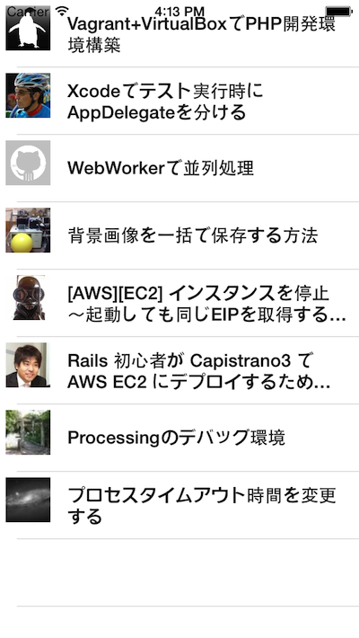
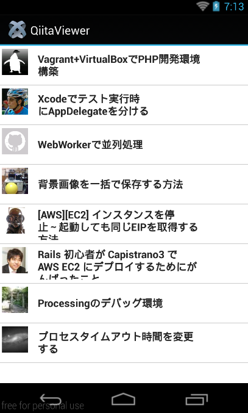

# スクロールしたら追加の情報を読み込む:実装編

さきほどはスクロールしたら追加の情報を読み込む実現方法についていくつかご紹介をしたので、この章では実装方法について解説します。

## 実装のポイントをまずは解説

TableViewSectionで投稿情報別に区切る方法を実装していきます。実装自体はシンプルそうに見えるのですが、いくつかポイントになる箇所があるのでまずはその点について解説します。


### QiitaのWebAPIのページネーションについて

QiitaのWebAPIにリクエストを投げる時に、何ページ目の情報を何件取得するのかオプションで指定することが出来るページネーションの機能が備わってます。

特にオプションの指定をせずに

https://qiita.com/api/v1/items

にアクセスすると、1ページ目の情報を20件取得する仕様になってます。（詳しくはQiitaのWeb APIのドキュメントを参照してください）

[https://qiita.com/docs](https://qiita.com/docs)

例えば、2ページ目の情報を取得したい場合にはURLの末尾に**?page=ページ名**を付け加えます。具体的には以下のようにします。

https://qiita.com/api/v1/items?page=2

また、リクエスト辺りの取得件数を5件に制限したい場合には**?per_page=件数**とすることで処理ができます。具体的には以下のようにします。

https://qiita.com/api/v1/items?per_page=5

上記2つを組み合わせて利用することも出来ます。パラメータを組み合わせる場合には、& で連結させます。以下は、2ページ目の情報を5件取得するという意味になります

https://qiita.com/api/v1/items?page=2&per_page=5

### TableViewSection作成時のheader指定について

1つのタイムラインのようなユーザインタフェースに見せるため、TableViewSection作成時にheaderViewやheaderTitleの設定は行わないようにします

### 画面下部までスクロールした時に発火させるイベント処理について

画面下部までスクロールした状態を検知するのにscrollEnd イベントを利用します。その際に

- WebAPIからデータを取得
- 起動時に最初に表示するページ情報を保持しておきscrollEnd イベント発火のタイミングでその保持してるページ情報を1つ増加させる
- データ取得後にTableViewSectionを生成した上で投稿情報を追加する

という処理を行うのですが、上記処理途中にスクロール出来る状態のままにしておくとscrollEndイベントが頻発してしまう可能性があります。

それを防ぐためにTalbeViewのスクロールを一時的に利用不可にしつつ、処理途中であることを明示したほうが使い勝手の良いアプリケーションにつながると思います。


## 実装

これまで作ってきたアプリケーションをベースに開発をしていきます。


### app.jsのソースコード

app.jsはそのまま流用します。念のためソースコードを以下記載しておきます

```javascript
var mainWindow,win;

mainWindow = require("mainWindow");
win = mainWindow.createWindow();	
win.open();		
```

### style.jsのソースコード

引っ張って更新処理を実装するで利用したソースコードをそのまま流用します。念のためソースコードを以下記載しておきます

```javascript
exports.mainTable = {
    "width": Ti.UI.FULL,
    "height": Ti.UI.FULL,
    "backgroundColor": "#fff",
    "separatorColor": "#ccc",
    "left": 0,
    "top": 0
};
exports.row = {
    "width": Ti.UI.FULL,
    "height":60,
    "borderWidth": 0,
    "className":"entry"
};
exports.iconImage = {
	top:5,
	left:5,
	width:40,
	height:40
};
exports.textLabel = {
    "width":250,
    "height":50,
    "top":5,
    "left":60,
    "color":"#222",
    "font":{
        "fontSize":16,
        "fontWeight":"bold"
    }
};
// 引っ張って更新処理中の色を指定
exports.refreshControl = {
    tintColor:'red'    
};

// QiitaのWebAPIから情報を読み込んでいる状態を示すために ActivityIndicatorを配置しためので
// その設定値
exports.actInd = {
    top:"20%",
    left:"30%",
    height:Ti.UI.SIZE,
    width:Ti.UI.SIZE,
    zIndex:0,
    color: "#f9f9f9",
    backgroundColor:"#444",
    font: {
        fontFamily:'Helvetica Neue',
        fontSize:16,
        fontWeight:'bold'
    },
    message: 'Loading...',
    style:Ti.UI.iPhone.ActivityIndicatorStyle.DARK
};
```

### qiita.jsのソースコード

QiitaのWebAPIにアクセスする際に何ページ目を取得するのか指定する必要があります。関数の引数にページ番号を設定し、かつ、QiitaのWebAPIへのアクセス時にページ番号のオプションを指定します

#### 変更前

```javascript
exports.getItems = function(callback){
    var xhr,qiitaURL,method;
    qiitaURL = "https://qiita.com/api/v1/items";
```

#### 変更後

```javascript
exports.getItems = function(page,callback){
	var xhr,qiitaURL,method;
	qiitaURL = "https://qiita.com/api/v1/items?page=" + page;
```

最終的には以下のようになります

```javascript
exports.getLocalJSON = function(){
  var sample,file,body;
  sample = Ti.Filesystem.getFile(Ti.Filesystem.resourcesDirectory, "sample.json");
  file = sample.read().toString();
  body = JSON.parse(file);
  return body;
};
// 今回拡張する機能
exports.getItems = function(page,callback){
	var xhr,qiitaURL,method;
	qiitaURL = "https://qiita.com/api/v1/items?page=" + page;
	Ti.API.info("qiitaURL is" + qiitaURL);
	method = "GET";
	xhr = Ti.Network.createHTTPClient();
	xhr.open(method,qiitaURL);
	xhr.onload = function(){
		var body;
		if (this.status === 200) {
			body = JSON.parse(this.responseText);
			Ti.API.info("number is :" + body.length);
			callback('ok',body);
		} else {
			Ti.API.info("error:status code is " + this.status);
		}
	};
	xhr.onerror = function(e) {
		var error;
		error = JSON.parse(this.responseText);
		Ti.API.info(error.error);
	};
	xhr.timeout = 5000;
	xhr.send();
};
```

### mainWindow.jsのソースコード

ユーザインタフェース側の処理が多くなるため、上記3つと比較すると少し長くなりますが、先にソースコード全体を以下に記載します。

```javascript
var style = require("style"),
    mainTable = Ti.UI.createTableView(style.mainTable),
    actInd = Ti.UI.createActivityIndicator(style.actInd),
    qiita = require("qiita"),
    pageNumber  = 1, //  (1)
    pageSection = 0; //  (2)

exports.createWindow = function(){
	var win = Ti.UI.createWindow({
		title:"QiitaViewer"
	});

	
	getQiitaItems(pageNumber,function(items){	     // (3)
		var section = Ti.UI.createTableViewSection();
		Ti.API.info("起動時にWebAPIからデータを取得しました");
		mainTable.setData([createSection(items,section)]); // (4)
		pageNumber++;
	});
	win.add(mainTable);
	win.add(actInd);
	return win;
};

mainTable.addEventListener('scrollEnd',function(e){
  // (5)
	mainTable.scrollable = false; 
	mainTable.opacity = 0.3;

	getQiitaItems(pageNumber,function(items){  // (6)
		var section = Ti.UI.createTableViewSection(),
		insertSection = createSection(items,section);  // (7)		
		mainTable.insertSectionAfter(pageSection,insertSection);  // (8)
    // (9)
		mainTable.scrollable = true;
		mainTable.opacity = 1.0;
		pageNumber++;
		pageSection++;
		
	});
});

// (10)
function getQiitaItems(page,callback){
	if (Ti.Network.online === false){
		alert("利用されてるスマートフォンからインターネットに接続できないため情報が取得できません");
	} else {
		actInd.show();
		qiita.getItems(page,function(status,items){
			actInd.hide();
			return callback(items);
		});
	}
	
};
// (11)
function createSection(items,section){
	var _i,_len,style = require("style");
	for (_i = 0, _len = items.length; _i < _len; _i++) {
		row = Ti.UI.createTableViewRow(style.row);
		textLabel = Ti.UI.createLabel(style.textLabel);
		iconImage = Ti.UI.createImageView(style.iconImage);
		iconImage.image = items[_i].user.profile_image_url;
		textLabel.text = items[_i].title;
		row.add(textLabel);
		row.add(iconImage);
		section.add(row);
		
	}
	return section;
};
```

#### コード解説

1. 起動時に表示するページ数を設定
2. TableViewSectionの挿入箇所となる変数を設定。
3. 起動時にWebAPIからデータを取得して投稿情報が取得できたらmainTableにセット
4. QiitaのWebAPIから取得した投稿情報を引数にして後述するcreateSection関数を利用してTableViewSectionを生成し、それをTableView.setData()を利用してTableViewに反映させる
5. scrollEndイベント発火した時に処理中であることを示すために、TableViewのscrollableの値をfalseに設定することで、スクロール出来ないように制御します。またその後のopacityの値をデフォルトの1.0から0に近い値（今回は0.3）に変更していますが、こうすることでTableView全体が少し暗くなり処理中であるというのが利用してるユーザさんにはより伝わりやすくなるかと思います。
6. 後述するgetQiitaItems関数を利用して、QiitaのWebAPIから投稿情報を取得します。
7. QiitaのWebAPIから取得した投稿情報を引数にして後述するcreateSection関数を利用してTableViewSectionを生成しておきます
8. TableViewのinsertSectionAfterメソッドを利用して上記7.で生成したTableViewSectionを挿入します。
9. 挿入処理が完了したので、TableViewのスクロール制御、透明度の設定をデフォルトの値に設定しなおしつつ、次に表示するページ数と、TableViewSectionの挿入箇所の変数をそれぞれ1つ増加させます
10. 引数にページ数を渡しqiita.getItems()を呼び出してQiitaのWeb APIから投稿情報を取得します。投稿情報取得できたらその値をコールバック関数に渡します
11. 引数にQiitaのWeb APIから取得できた投稿情報を渡して必要な要素が追加されたTableViewRowを順番に生成し、そのRowをTableViewSectionに順番に追加して、最後にそのTableViewSectionを返します

## 最終的な実行結果

スクロール中の状態を画面キャプチャー取れないので見た目にはわかりづらいのですが以下のようになります。

### iPhoneでの実行イメージ



### Androidでの実行イメージ


