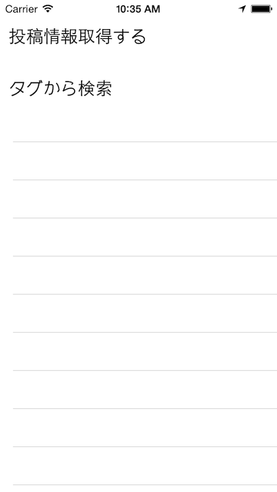
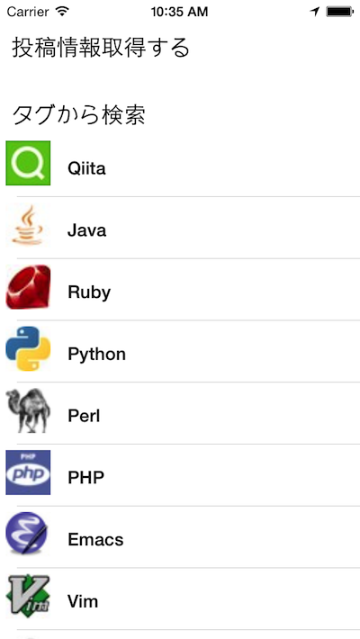
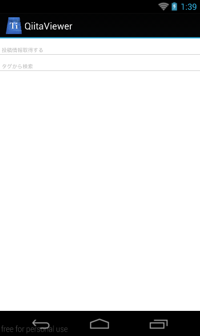
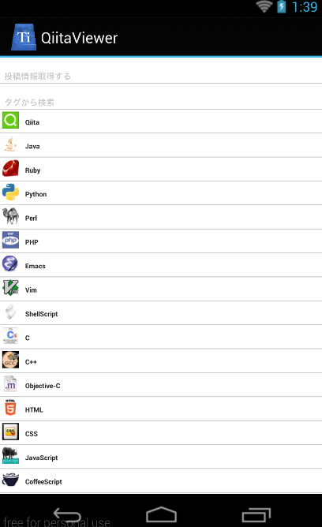
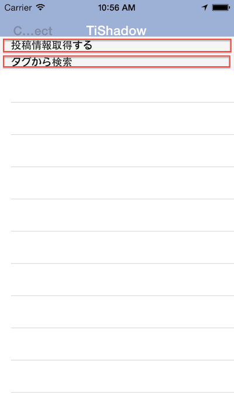
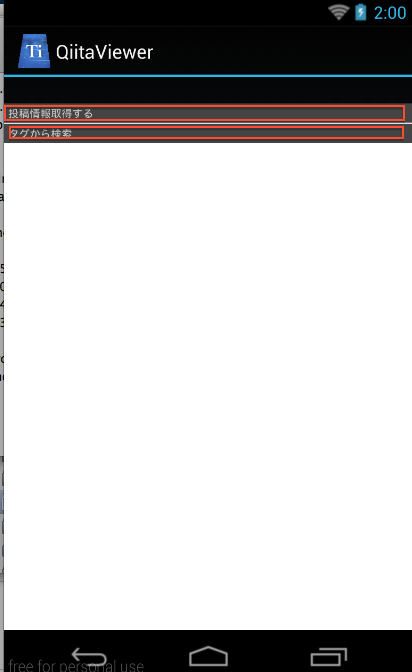

# メニュー一覧→サブメニューを展開するようなユーザインタフェースを実現する方法

## はじめに

これまで作ってきたようなQiitaのビューワーアプリケーションのような場合に、メニュー一覧から詳細情報に移る場合には、画面遷移させるのが一般的かと思います。

ただ、状況によって、画面遷移させずにメニュー一覧からサブメニューを展開するようなユーザインタフェースを実現したい場合も出てくるかと思います。

例えば、起動時に最小限のメニューを表示しておき、**タグから検索**という箇所をタッチするとサブメニューのタグ一覧が展開されるようなイメージです。


### iPhoneでのイメージ

#### 起動時の画面



#### タグから検索の項目をタッチした後の画面



### Androidでのイメージ

#### 起動時の画面




#### タグから検索の項目をタッチした後の画面




## 実装におけるポイント

先ほどの章で紹介したTableViewSectionで投稿情報別に区切る方法をベースに考えます。

メニュー一覧の表示方法として

- メニュー一覧にTableViewSectionのheaderTitleを設定する
- TableViewSectionのHeaderViewにカスタマイズしたものを設定する

という２つがあります。

前者を採用すると、以下のように領域がかなり小さくなってしまい、使い勝手があまり良いとはいえないものになります。





後者のTableViewSectionのHeaderViewにカスタマイズしたものを設定方法を利用することで、メニューの幅の部分も好みのサイズに設定可能になるため、この方法を採用します。

## 実装

これまで作ってきたアプリケーションをベースにして、それぞれのファイルを実装してきます。

### app.js

ここはそのまま流用できるのと、説明するべき箇所もないのでコードの記載だけにとどめます。

```javascript
var mainWindow,win;

mainWindow = require("mainWindow");
win = mainWindow.createWindow();	
win.open();		
```

### style.js

ここは大きな変更はないのですが

- タグ一覧のメニューを生成する際に利用するタグのラベル
- タグのアイコン画像に対応する情報
- TableViewSectionのカスタムビューに適用するViewとLabelの設定情報

について追記してます。

```javascript
exports.mainTable = {
    "width": Ti.UI.FULL,
    "height": Ti.UI.FULL,
    "backgroundColor": "#fff",
    "separatorColor": "#ccc",
    "left": 0,
    "top": 0
};
exports.row = {
    "width": Ti.UI.FULL,
    "height":60,
    "borderWidth": 0,
    "className":"entry"
};
exports.iconImage = {
	top:5,
	left:5,
	width:40,
	height:40
};
exports.textLabel = {
    "width":250,
    "height":50,
    "top":5,
    "left":60,
    "color":"#222",
    "font":{
        "fontSize":16,
        "fontWeight":"bold"
    }
};
// 引っ張って更新処理中の色を指定
exports.refreshControl = {
    tintColor:'red'    
};

// QiitaのWebAPIから情報を読み込んでいる状態を示すために ActivityIndicatorを配置しためので
// その設定値
exports.actInd = {
    top:"20%",
    left:"30%",
    height:Ti.UI.SIZE,
    width:Ti.UI.SIZE,
    zIndex:0,
    color: "#f9f9f9",
    backgroundColor:"#444",
    font: {
        fontFamily:'Helvetica Neue',
        fontSize:16,
        fontWeight:'bold'
    },
    message: 'Loading...',
    style:Ti.UI.iPhone.ActivityIndicatorStyle.DARK
};

exports.tagLabel = {
    "width":250,
    "height":50,
    "top":5,
    "left":60,
    "color":"#222",
    "font":{
        "fontSize":16,
        "fontWeight":"bold"
    }
};
exports.iconImage = {
	top:5,
	left:5,
	width:40,
	height:40
};

exports.headerView = {
  width:Ti.UI.FULL,
  height:60
};

exports.headerTitle = {
  top:"50%",
  left:10,
  width:"90%",
  font:{
    fontSize:"20%"
  }
};
```

### qiita.js

従来あったgetItems()という関数内でアクセスする先のURLを**https://qiita.com/api/v1/items**から**https://qiita.com/api/v1/tags**に変更することでタグ一覧情報を取得する処理が実装できます。
そのためgetItems()とgetTags()はアクセス先のURLが異なるだけで、それ以外の処理は共通化できるため、

- 外部から呼び出せる関数
    - getItems()
    - getTags()
- qiita.jsの内部だけで参照できる関数
    - requestToQiitaAPI()

という形で実装をしてます。


```javascript
exports.getLocalJSON = function(){
  var sample,file,body;
  sample = Ti.Filesystem.getFile(Ti.Filesystem.resourcesDirectory, "sample.json");
  file = sample.read().toString();
  body = JSON.parse(file);
  return body;
};

exports.getItems = function(callback){
	var qiitaURL = "https://qiita.com/api/v1/items";
    requestToQiitaAPI(qiitaURL,callback);
};

exports.getTags = function(callback){
	var qiitaURL = 'https://qiita.com/api/v1/tags';
    requestToQiitaAPI(qiitaURL,callback);
};

function requestToQiitaAPI(qiitaURL,callback){
	var xhr,method;
	method = "GET";
	xhr = Ti.Network.createHTTPClient();
	xhr.open(method,qiitaURL);
	xhr.onload = function(){
		var body;
		if (this.status === 200) {
			body = JSON.parse(this.responseText);
			callback(body);
		} else {
			Ti.API.info("error:status code is " + this.status);
		}
	};
	xhr.onerror = function(e) {
		var error;
		error = JSON.parse(this.responseText);
		Ti.API.info(error.error);
	};
	xhr.timeout = 5000;
	xhr.send();
}
```

### mainWindow.js

ここは修正箇所が多いので、まずは実装する関数の対応関係について簡単にまとめます

- 外部から呼び出せる関数
    - createWindow()
- mainWindow.jsの内部だけで参照できる関数
    - initTableViewSection()
        - 起動時のメインメニューとして利用するTableViewSectionを生成
    - createTagSection()
        - **タグから検索**のラベルがクリックされた時に呼び出される関数で、QiitaAPI通じてタグ一覧を取得する

```javascript
var style = require("style"),
    mainTable = Ti.UI.createTableView(style.mainTable),
    actInd = Ti.UI.createActivityIndicator(style.actInd),
    qiita = require("qiita");

function initTableViewSection(tableview){
	var section,
      headerView,
      menuLit = ['投稿情報取得する','タグから検索'],
      _i,
      _len,
      headerTitle,
      rows = [];
	for (_i = 0, _len = menuLit.length; _i < _len; _i++) {
      headerView = Ti.UI.createView(style.headerView);
      headerTitle = Ti.UI.createLabel(style.headerTitle);
      headerTitle.text = menuLit[_i];
      headerTitle.addEventListener('click',function(e){    // (1) 
        if(e.source.text === "タグから検索"){                 // (2)
  		    actInd.show();
  		    qiita.getTags(function(tags){
  			    var section = createTagSection(tags);      // (3)
                  tableview.insertSectionAfter(1,section); // (4)
  			    actInd.hide();
  		    });
        }
      });
      headerView.add(headerTitle);
      
      section = Ti.UI.createTableViewSection({"headerView":headerView});
      rows.push(section);
		
	}
  tableview.setData(rows);

}

function createTagSection(tags){                          // (5)
	var section,_i,_len,style = require("style"),row,tagLabel,iconImage;
    section = Ti.UI.createTableViewSection();
	for (_i = 0, _len = tags.length; _i < _len; _i++) {
		row = Ti.UI.createTableViewRow(style.tagRow);
		tagLabel = Ti.UI.createLabel(style.tagLabel);
		iconImage = Ti.UI.createImageView(style.iconImage);
		tagLabel.text = tags[_i].name;
		iconImage.image = tags[_i].icon_url;
		row.add(tagLabel);
		row.add(iconImage);
        section.add(row);
	}
	return section;
} 
exports.createWindow = function(){
	var win = Ti.UI.createWindow({
		title:"QiitaViewer"
	});
	win.add(mainTable);
	win.add(actInd);
    initTableViewSection(mainTable);
	return win;
};

```

1. TableViewSectionのカスタムヘッダーに設定したTi.UI.Labelにイベントリスナーを割り当てます。
2. 上記割り当てたイベントリスナーで今回は**タグから検索**がタッチされた時のみイベントを発火させたいため、e.source.textの値をチェックした上で処理を実施
3. qiita.getTags()関数を利用して、QiitaのWebAPIからタグ一覧情報を取得出来て変数tagsに格納されているため、その変数tagsを後述するcreateTagSection()に引き渡して、タグ一覧情報を生成する
4. Ti.UI.TablViewのinsertSectionAfter()を利用して、**タグから検索**の行の後に、タグ一覧の情報を挿入する
5. QiitaのWebAPIから取得したタグの件数（デフォルトでは20件）分、ループ処理して、タグの画像とタグのタイトル名を配置したTableViewRowを生成しつつ、そのTableViewRowをタグ一覧用に表示するためのTableViewSectionに順番に追加していく
