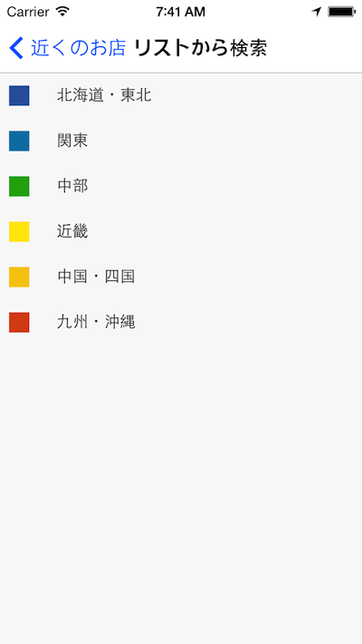
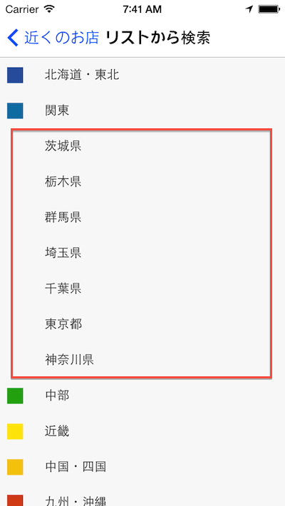

# メニュー一覧→サブメニューを展開するようなユーザインタフェースを実現する方法

## はじめに

これまで作ってきたようなQiitaのビューワーアプリケーションのような場合に、メニュー一覧から詳細情報に移る場合には、画面遷移させるのが一般的かと思います。

ただ、状況によって、画面遷移させずにメニュー一覧からサブメニューを展開するようなユーザインタフェースを実現したい場合も出てくるかと思います。

例えば、起動時にこのように都道府県のエリア名を表示。

任意のエリアをタッチすると、画面遷移させずに、このようにそこに紐づく都道府県が展開するようなユーザインタフェースのイメージです

こういう機能はTitanium標準のAPIを上手く組み合わせることで実現できるので以下に実装方法を解説しています。
