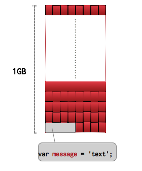
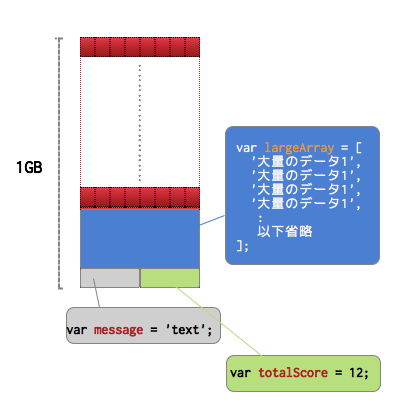

# 変数について

JavaScriptに限らずプログラミングをする上で、変数の扱いについてある程度理解しておく必要があるかと思い、変数について簡単に説明をしておきます。

## 変数のイメージ

変数はよく「箱」に例えられて解説されると思いますが、以下のようなイメージを持たれた方が実際の作業を進める上で適切かと思ってます

仮に1GBのメモリを持ったスマートフォンがあった場合には、1GBという大きな1つの箱があるわけではなく、一列に８個の箱が縦に大量に積み上がってる状態を頭のなかで描いたほうがより適切になるかと思います。

## プログラム中で変数を宣言した時のイメージ

変数が宣言された段階でこのようにスマートフォン上のメモリの一部が利用（確保）されるイメージになります。

## 変数宣言をいくつか行った後のイメージ

その後変数が宣言される度に、このようにスマートフォン上のメモリが利用（確保）されてきます。

